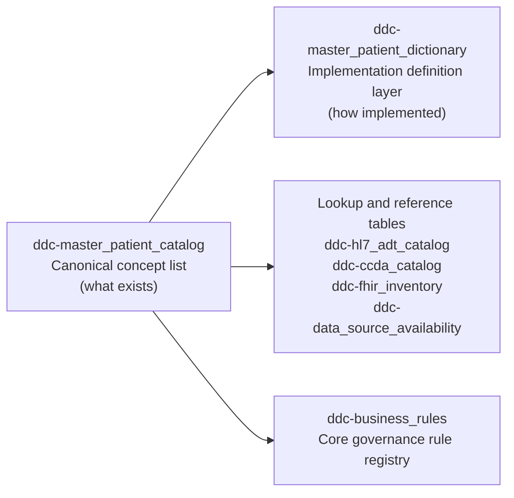

## chi-data-dictionary-catalog (POC)

Lightweight, local proof‑of‑concept for viewing a **data catalog** and **data dictionary** that are authored in Excel and stored as Parquet files. Designed to be easy to move between machines.

---

### Interoperability staff quick view

This project follows a simple **3-layer operating model**:

- **Layer 1: partner intake**: source-system inventory stays in Excel/workbook form outside this repo and outside the Airtable steward base.
- **Layer 2: CHI governance**: curated semantics, standards alignment, survivorship definitions, and rule metadata live in the repo's parquet-backed model.
- **Layer 3: Airtable steward workspace**: Airtable provides the review, lookup, queue, and workflow surface over the governed model.

In practical terms:

- **Primary steward interface**: Airtable base (`ddc-*` governance and lookup tables).
- **Authoring/source layer**: Excel/CSV and mapping CSVs continue to drive parquet artifacts.
- **Sync model**: parquet remains the machine-managed source for the steward base; `upload_parquet_to_airtable.py` syncs it into Airtable.

Use `docs/airtable-setup.md` as the operational guide for schema, workflow, and review.

---

### Naming clarity and table roles

If `ddc-master_patient_catalog` feels ambiguous, this is the intended meaning:

- `master_patient` = person-centric canonical scope (not an operational EHR patient table)
- `catalog` = governed list of canonical concepts (`semantic_id`)

Working model:

- `ddc-master_patient_catalog` is the **canonical concept list**
- `ddc-master_patient_dictionary` is the **implementation definition layer**
- `ddc-business_rules` is the **active rule/governance registry**
- interoperability lookup tables (`ddc-hl7_adt_catalog`, `ddc-ccda_catalog`, `ddc-fhir_inventory`) support steward lookup and mapping review
- `ddc-data_source_availability` is an operational reference table, not the partner intake workbook



Table update expectations:

- **Core governance**: `ddc-master_patient_catalog`, `ddc-master_patient_dictionary`, `ddc-business_rules`
- **Interoperability lookup/reference**: `ddc-hl7_adt_catalog`, `ddc-ccda_catalog`, `ddc-fhir_inventory`
- **Operational reference**: `ddc-data_source_availability`

---

### Quick start (new machine)

1. **Clone or copy this folder** onto the target machine (e.g. `C:\AI\chi-data-dictionary-catalog`).
2. Open a terminal in this folder and create a virtual environment:

   ```powershell
   python -m venv .venv
   .venv\Scripts\activate
   ```

3. **Install dependencies**:

   ```powershell
   pip install -r requirements.txt
   ```

4. **Open the viewer notebook (local dev)**:
   - In Cursor/VS Code: open `chi-data-dictionary-catalog.ipynb` and select the `.venv` interpreter.
   - Run the first cell (`os.chdir(...)`) and the DuckDB query cells to explore `ddc-master_patient_catalog.parquet` and `ddc-master_patient_dictionary.parquet`.

For more detail on Jupyter + DuckDB setup, see `docs/jupyter-duckdb-parquet-setup.md`.

---

### Data pipeline (authoring to Parquet + Airtable)

1. Collect partner/source input in an external intake workbook when needed.
2. Author or update governed metadata in Excel/CSV (one combined export with catalog + dictionary columns for the governed layer).
3. From this folder, run:

   ```powershell
   .venv\Scripts\activate
   python scripts/split_to_catalog_and_dictionary.py path\to\combined_export.csv
   ```

4. The script regenerates:
   - `ddc-master_patient_catalog.parquet` — catalog view (one row per element).
   - `ddc-master_patient_dictionary.parquet` — dictionary view (definition and rules per element).

Both files use **snake_case** column names (e.g. `semantic_id`, `uscdi_element`, `chi_survivorship_logic`).
Legacy intake headers such as `SHIE Survivorship Logic` and `HIE Survivorship Logic` are normalized to `chi_survivorship_logic`.

**Existing Parquet (no CSV):** To add CHI alignment columns (governance, identity, security, FHIR compliance, survivorship enhancements) to existing Parquet without re-running split on a CSV:
   ```powershell
   python scripts/split_to_catalog_and_dictionary.py --upgrade-schema -d .
   ```

**Optional — rebuild message-format catalogs & source availability:**
- ADT: `python scripts/build_adt_catalog_from_mapping.py` → `ddc-hl7_adt_catalog.parquet` (mapping input defaults to `data/l2_to_semantic_id_mapping.csv`; archive fallback is supported).
- CCD/CCDA: `python scripts/build_ccda_catalog_from_mapping.py` → `ddc-ccda_catalog.parquet` (mapping input defaults to `data/ccd_to_semantic_id_mapping.csv`; archive fallback is supported).
- Data source availability: `python scripts/build_data_source_availability.py` → `ddc-data_source_availability.parquet` (links sources to semantic IDs).
- Standards inventories and rules: `python scripts/build_standards_inventories.py -d .` → `ddc-fhir_inventory.parquet`, `ddc-business_rules.parquet`.
- ADT/CCDA governance fields are now promoted into canonical catalogs (`ddc-hl7_adt_catalog.parquet`, `ddc-ccda_catalog.parquet`): `mapping_status`, `business_rule_required`, `business_rule_notes`.

**Airtable sync:**
- Core + inventories: `python scripts/upload_parquet_to_airtable.py --include-standards-inventories`
- Add relation fields for steward navigation: `python scripts/upload_parquet_to_airtable.py --include-standards-inventories --add-relations`
- Optional portability inputs: set `AIRTABLE_API_KEY` and `AIRTABLE_BASE_ID`, or pass `--base-id` / `--base-dir` explicitly.
See `data/README.md` and `docs/cmt-adt-feed-and-master-patient.md`.

---

### Files of interest

- `docs/documentation-map.md` — canonical vs historical doc index.
- `readme-prd.md` — 1‑page executive PRD for stakeholders.
- `README.md` — this technical quick‑start guide.
- `TECH-SPEC.md` — Technical specification: architecture strategy, file/table definitions, column schemas, UI layout.
- `docs/archive/EVALUATION.md` — historical interoperability evaluation snapshot and roadmap context.
- `scripts/split_to_catalog_and_dictionary.py` — CSV → Parquet splitter.
- `ddc-master_patient_catalog.parquet` — catalog table.
- `ddc-master_patient_dictionary.parquet` — dictionary table.
- `ddc-data_source_availability.parquet` — source-to-semantic_id availability matrix.
- `scripts/upload_parquet_to_airtable.py` — re-runnable Airtable uploader (Question #2), with optional Link/Relation fields.
- `docs/airtable-setup.md` — Airtable setup notes (Node + MCP), including troubleshooting.
- `docs/jupyter-duckdb-parquet-setup.md` — full notebook + DuckDB setup instructions.

