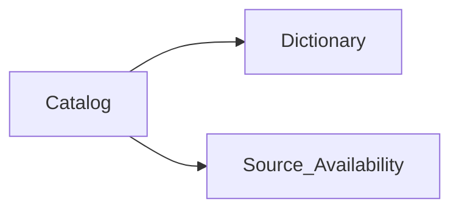

## chi-data-dictionary-catalog (POC)

**Governed data catalog and data dictionary** for CHI patient concepts (`semantic_id`), curated against **healthcare standards** (USCDI, US Core, terminology), with dictionary detail and **interop views for HL7 ADT, C-CDA, and FHIR**.

Full vision: **`docs/product-vision.md`**

---

### POC in one sentence

Edit `chi-steward-workbook.xlsx` → import to parquet → review in Power BI (**Concept Profile** + **Standards & Contexts**).

---

### What to use (and what to ignore for now)

| Authoring (use now) | Optional read | Defer |
|---------------------|---------------|-------|
| `workbooks/chi-steward-workbook.xlsx` | `workbooks/pbip/chi-data-dictionary-catalog.pbip` (Power BI) | SharePoint |
| `Catalog` + `Dictionary` + `Source_Availability` + `ADT_Mappings` + `CCDA_Mappings` | See `docs/power-bi-concept-profile-setup.md` | Partner intake workbook |
| `Concept_Explorer` sheet | Jupyter notebook (`chi-data-dictionary-catalog.ipynb`) for ad-hoc DuckDB queries only | Full 28-source coverage |
| `import_steward_workbook_to_parquet.py` | | Azure DevOps, Innovaccer DEM |
| 5 demographics attributes | `workbooks/chi-partner-intake-workbook.xlsx` when onboarding partners | FHIR inventory curation |

**POC goal:** prove governed catalog + dictionary + standards + message contexts (ADT/CDA/FHIR) on one `semantic_id`.

**Pilot status:** `docs/demographics-pilot-plan.md` · **Standards:** `docs/shie-standards-reference.md` · **FAQ:** `docs/faq.md` (catalog vs dictionary, PBIP pages)

### Governance workflow

```text
Excel (author)  →  import script  →  parquet  →  Power BI Refresh (read)
```

Excel does not auto-update parquet - run the import script after each save. Layer roles and the publish ritual: **`docs/excel-workbook-guide.md`** (*Operating model*). Level A production (git, no SharePoint): **`docs/operational-runbook.md`**.

---

### Quick start

```powershell
python -m venv .venv
.venv\Scripts\activate
pip install -r requirements.txt
```

1. Open `workbooks/chi-steward-workbook.xlsx`.
2. In `Concept_Explorer`, set B3 to `Patient.race` (then ethnicity, language, gender identity, birth sex).
3. Complete `Catalog`, `Dictionary`, and `Source_Availability` for those five rows.
4. Save workbook edits back to parquet:

   ```powershell
   python scripts/import_steward_workbook_to_parquet.py
   ```

5. Optional - open `workbooks/pbip/chi-data-dictionary-catalog.pbip` in Power BI Desktop and **Refresh** (see `docs/power-bi-concept-profile-setup.md`). For ad-hoc parquet queries only, use `chi-data-dictionary-catalog.ipynb` (`docs/jupyter-duckdb-parquet-setup.md`).

Regenerate workbook from parquet after script rebuilds:

```powershell
python scripts/generate_steward_workbook.py
```

Terminology and crosswalk rebuild (see `docs/crosswalk-model.md`):

```powershell
python scripts/build_value_set_members.py --write-cache
python scripts/seed_county_master_crosswalk.py
python scripts/seed_gender_identity_terminology.py
python scripts/seed_partner_crosswalk_template.py
python scripts/enrich_parquet_for_pbi.py
python scripts/generate_steward_workbook.py
```

PBIP layout (maintainers): `python scripts/add_pbip_start_here_page.py` · `python scripts/patch_pbip_readability.py`

---

### Core artifacts

| Artifact | Role |
|----------|------|
| `chi-steward-workbook.xlsx` | Primary steward surface (authoring) |
| `workbooks/pbip/chi-data-dictionary-catalog.pbip` | Read-only catalog/dictionary viewer |
| `ddc-master_patient_catalog.parquet` | One row per governed concept |
| `ddc-master_patient_dictionary.parquet` | Implementation detail per concept |
| `ddc-data_source_availability.parquet` | Concept ↔ source links |

Interop context parquet (`ddc-hl7_adt_catalog`, `ddc-ccda_catalog`) links the same `semantic_id` to **HL7 ADT** and **C-CDA** paths. Terminology layer: `ddc-value_set_binding`, `ddc-value_set_member`, `ddc-source_value_crosswalk` - see `docs/crosswalk-model.md`. Optional: `ddc-fhir_inventory`, `ddc-business_rules`.

PBIP-only (not from steward import): `ddc-application_guide.parquet` and `ddc-application_guide_gaps.parquet` power the in-report **Guide · Field guide** tab. See `docs/faq.md` → *Why does the PBIP semantic model have nine tables?*

---

### Data model

- `ddc-master_patient_catalog` - **what** CHI governs (`semantic_id`, USCDI, classification, approval)
- `ddc-master_patient_dictionary` - **how** it is implemented (FHIR, survivorship, source rank)
- Join key: `semantic_id`



---

### Optional pipeline (not required for demographics POC)

```powershell
python scripts/split_to_catalog_and_dictionary.py path\to\combined_export.csv
python scripts/build_adt_catalog_from_mapping.py
python scripts/build_ccda_catalog_from_mapping.py
python scripts/build_data_source_availability.py
python scripts/build_standards_inventories.py -d .
python scripts/generate_intake_workbook.py
```

---

### Documentation

- `docs/product-vision.md` - north star (governance + standards + ADT/CDA/FHIR contexts)
- `docs/sources-of-truth.md` - layered authority (US standards, DAP, CHI publish, crosswalk)
- `docs/demographics-pilot-plan.md` - pilot status, phased plan, per-attribute checklist
- `docs/shie-standards-reference.md` - SHIE standards (CDCREC, US Core, BCP 47) → pilot attributes
- `docs/crosswalk-model.md` - value set bindings, governed codes, source crosswalk tables
- `docs/operational-runbook.md` - Level A production: roles, publish ritual, git policy, checklists
- `docs/excel-workbook-guide.md` - POC workbook guide (start here for stewards)
- `docs/power-bi-concept-profile-setup.md` - Power BI viewer setup and refresh
- `docs/excel-workbook-generation-rules.md` - openpyxl rules (avoid Excel repair prompts)
- `readme-prd.md` - executive summary for stakeholders
- `TECH-SPEC.md` - full architecture reference
- `docs/documentation-map.md` - canonical vs historical docs
