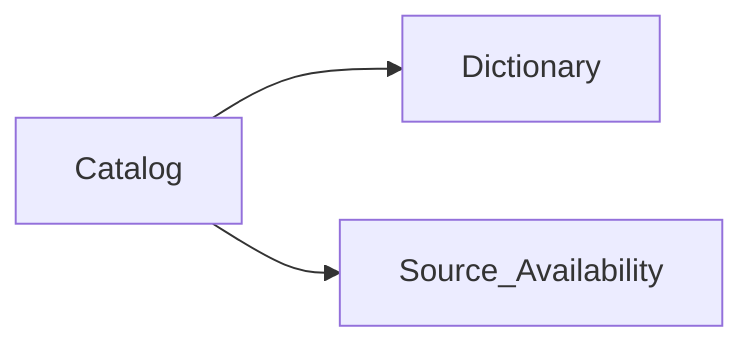

## chi-data-dictionary-catalog (POC)

Local proof-of-concept: govern patient data elements in **Excel**, store them as **parquet** in this folder, and validate the catalog/dictionary model works before any platform investment.

---

### POC in one sentence

Edit `chi-steward-workbook.xlsx` → import to parquet → review in Power BI (optional Jupyter for ad-hoc queries).

---

### What to use (and what to ignore for now)

| Authoring (use now) | Optional read | Defer |
|---------------------|---------------|-------|
| `workbooks/chi-steward-workbook.xlsx` | `workbooks/pbip/chi-data-dictionary-catalog.pbip` (Power BI) | SharePoint |
| `Catalog` + `Dictionary` + `Source_Availability` | See `docs/power-bi-concept-profile-setup.md` | Partner intake workbook |
| `Concept_Explorer` sheet | Jupyter notebook (`chi-data-dictionary-catalog.ipynb`) for ad-hoc DuckDB queries only | Full 28-source coverage |
| `import_steward_workbook_to_parquet.py` | | Azure DevOps, Innovaccer DEM |
| 5 demographics attributes | | FHIR inventory curation |

**POC goal:** prove that `semantic_id` joins business catalog to technical dictionary in a maintainable Excel workflow.

**Pilot status and next steps:** `docs/demographics-pilot-plan.md`

---

### Quick start

```powershell
python -m venv .venv
.venv\Scripts\activate
pip install -r requirements.txt
```

1. Open `workbooks/chi-steward-workbook.xlsx`.
2. In `Concept_Explorer`, set B3 to `Patient.race` (then ethnicity, language, gender identity, birth sex).
3. Complete `Catalog`, `Dictionary`, and `Source_Availability` for those five rows.
4. Save workbook edits back to parquet:

   ```powershell
   python scripts/import_steward_workbook_to_parquet.py
   ```

5. Optional — open `workbooks/pbip/chi-data-dictionary-catalog.pbip` in Power BI Desktop and **Refresh** (see `docs/power-bi-concept-profile-setup.md`). For ad-hoc parquet queries only, use `chi-data-dictionary-catalog.ipynb` (`docs/jupyter-duckdb-parquet-setup.md`).

Regenerate workbook from parquet after script rebuilds:

```powershell
python scripts/generate_steward_workbook.py
```

---

### Core artifacts

| Artifact | Role |
|----------|------|
| `chi-steward-workbook.xlsx` | Primary steward surface (authoring) |
| `workbooks/pbip/chi-data-dictionary-catalog.pbip` | Read-only catalog/dictionary viewer |
| `ddc-master_patient_catalog.parquet` | One row per governed concept |
| `ddc-master_patient_dictionary.parquet` | Implementation detail per concept |
| `ddc-data_source_availability.parquet` | Concept ↔ source links |

Additional parquet files (`ddc-hl7_adt_catalog`, `ddc-ccda_catalog`, `ddc-fhir_inventory`, `ddc-business_rules`) support interoperability demos and can be ignored until needed.

---

### Data model

- `ddc-master_patient_catalog` — **what** CHI governs (`semantic_id`, USCDI, classification, approval)
- `ddc-master_patient_dictionary` — **how** it is implemented (FHIR, survivorship, source rank)
- Join key: `semantic_id`



---

### Optional pipeline (not required for demographics POC)

```powershell
python scripts/split_to_catalog_and_dictionary.py path\to\combined_export.csv
python scripts/build_adt_catalog_from_mapping.py
python scripts/build_ccda_catalog_from_mapping.py
python scripts/build_data_source_availability.py
python scripts/build_standards_inventories.py -d .
python scripts/generate_intake_workbook.py
```

---

### Documentation

- `docs/demographics-pilot-plan.md` — pilot status, phased plan, per-attribute checklist
- `docs/excel-workbook-guide.md` — POC workbook guide (start here for stewards)
- `docs/power-bi-concept-profile-setup.md` — Power BI viewer setup and refresh
- `docs/excel-workbook-generation-rules.md` — openpyxl rules (avoid Excel repair prompts)
- `readme-prd.md` — executive summary for stakeholders
- `TECH-SPEC.md` — full architecture reference
- `docs/documentation-map.md` — canonical vs historical docs
