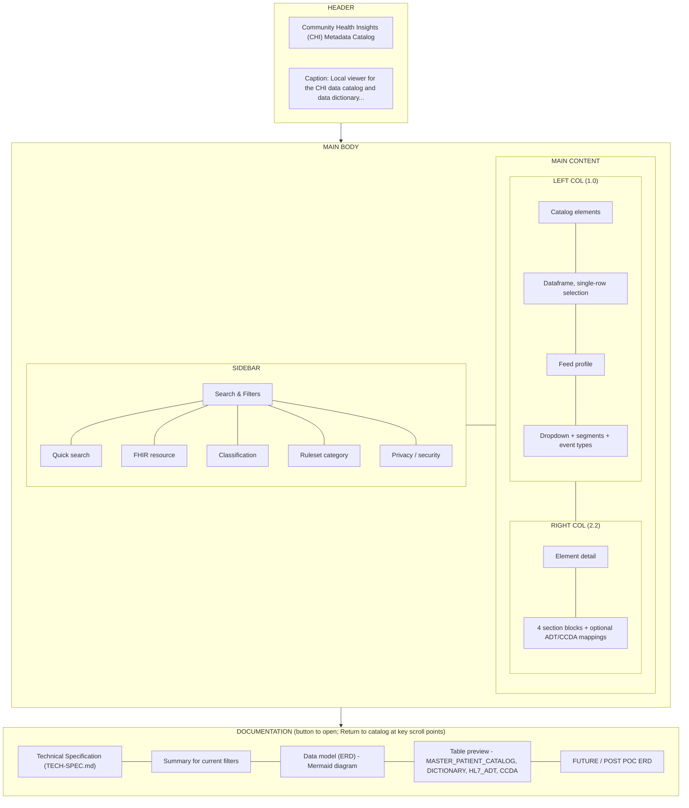

# CHI Metadata Catalog — Technical Specification

This document describes the **architecture strategy**, **architecture itself**, **file and table definitions**, **column schemas**, **test data display**, and **UI layout, organization, and logic** for the chi-data-dictionary-catalog project. It serves as an implementation reference for engineers and maintainers.

For product context (why, who, scope), see **readme-prd.md**. For quick setup, see **README.md**.

---

## 1. Architecture Strategy

### 1.1 Why This Architecture Exists

The CHI metadata catalog architecture was designed to address several strategic constraints and goals:

1. **Person-centric vs. message-centric separation** — Master patient attributes (demographics, survivorship) are fundamentally different from message-format specifications (HL7 ADT segments, CCD/CCDA XML paths). Combining them in one schema creates semantic confusion, governance conflicts, and query inefficiency.

2. **Different consumers, different query patterns** — Data engineers building ADT interfaces need message-level specs (segments, fields, event types). Domain SMEs and stewards need person-level attributes (survivorship, source hierarchy). Forcing both into one schema means every query drags irrelevant columns.

3. **Different governance cadences** — HL7 v2 specs change when onboarding a new hospital or partner. Master patient attributes change when survivorship or source hierarchy changes. These should not trigger schema evolution in the same artifact.

4. **Different stewardship models** — Interface engineers own message specs; domain SMEs (e.g., Housing Services, data governance) own patient attributes. Mixing ownership creates approval bottlenecks.

5. **L3 as canonical truth** — The master demographics layer (L3) is the single source of truth. ADT messages, CCDA documents, and FHIR resources are **renderings** of that truth in different formats for different partners. Message catalogs define *where* each attribute lands in each format; they do not duplicate business logic.

### 1.2 Key Design Principles

| Principle | Rationale |
|-----------|-----------|
| **Catalogs are format-specific** | ADT, CCDA, FHIR have fundamentally different structures. Querying "What fields exist in a PID segment?" is different from "What elements exist in a CCDA Social History section?" |
| **Dictionary stays separate from message specs** | L3 survivorship rules are independent of interoperability. Partner-specific rules belong in a crosswalk (future), not the core dictionary. |
| **Link via semantic_id** | The `semantic_id` (e.g., `Patient.name_first`, `Patient.birth_date`) is the universal join key. Master catalog ↔ dictionary is 1:1; master catalog ↔ message catalogs is 1:many. |
| **Crosswalks for output, not input** | Inbound: everyone's data is normalized to L3 using catalog + dictionary. Outbound: L3 is customized per partner using catalogs + crosswalk. |
| **POC scope** | Value-set tables, FHIR catalog, and interoperability crosswalk are strategically deferred. The current POC proves the model with four tables. |

### 1.3 What Was Explicitly Rejected

- **Single unified catalog** — "One metadata catalog to rule them all" fails because different consumers, cadences, and stewards need separation.
- **Forcing HL7 into data_catalog / data_dictionary** — Person-centric and event-centric models were kept separate.
- **Format-specific dictionaries** — For POC, message catalogs carry minimal notes; a unified crosswalk (future) will handle partner rules.

---

## 2. Architecture

### 2.1 High-Level Data Flow

### 2.2 File and Directory Layout

| Location | Content |
|----------|---------|
| **Project root** | `app.py`, Parquet files, README, docs |
| **master_patient_catalog.parquet** | Required. Catalog view. |
| **master_patient_dictionary.parquet** | Required. Dictionary view. |
| **hl7_adt_catalog.parquet** | Optional. ADT field mappings. |
| **ccda_catalog.parquet** | Optional. CCD/CCDA XML mappings. |
| **scripts/** | `split_to_catalog_and_dictionary.py`, `build_adt_catalog_from_mapping.py`, `build_ccda_catalog_from_mapping.py` |
| **data/** | Mapping CSVs, feed profiles (segments, event types) |
| **docs/** | `adding-data-sources.md`, `cmt-adt-feed-and-master-patient.md`, `jupyter-duckdb-parquet-setup.md` |

### 2.3 Entity-Relationship (POC)

- **MASTER_PATIENT_CATALOG** ↔ **MASTER_PATIENT_DICTIONARY**: 1:1 on `semantic_id`
- **MASTER_PATIENT_CATALOG** → **HL7_ADT_CATALOG**: 1:many (one element can map to multiple ADT fields)
- **MASTER_PATIENT_CATALOG** → **CCDA_CATALOG**: 1:many (one element can map to multiple CCD/CCDA locations)

---

## 3. File and Table Definitions

### 3.1 Core Tables (Required)

#### MASTER_PATIENT_CATALOG (`master_patient_catalog.parquet`)

**Purpose:** Defines **what elements exist** and how they are grouped. One row per data element. Answers: *What attributes does CHI track?*

**Grain:** One row per `semantic_id` (primary key).

**Source:** Produced by `scripts/split_to_catalog_and_dictionary.py` from a combined Excel export CSV.

---

#### MASTER_PATIENT_DICTIONARY (`master_patient_dictionary.parquet`)

**Purpose:** Defines **what each element means** and **how it is implemented**. Survivorship rules, FHIR mapping, data quality notes. Answers: *How do we determine the golden value? Where does it live in FHIR?*

**Grain:** One row per `semantic_id` (foreign key to catalog).

**Source:** Same split script. Historical note: Excel column "SHIE Survivorship Logic" becomes `hie_survivorship_logic` in Parquet.

---

### 3.2 Optional Message-Format Catalogs

#### HL7_ADT_CATALOG (`hl7_adt_catalog.parquet`)

**Purpose:** Maps master patient elements to **HL7 ADT message structure**. Each row describes where a `semantic_id` appears in ADT messages (segment, field, data type, optionality).

**Grain:** One row per (segment_id, field_id, semantic_id) combination. One semantic_id can have multiple rows (e.g., PID-5.1 and PID-5.2 both map to name elements).

**Source:** Built by `scripts/build_adt_catalog_from_mapping.py` from `data/l2_to_semantic_id_mapping.csv`.

---

#### CCDA_CATALOG (`ccda_catalog.parquet`)

**Purpose:** Maps master patient elements to **CCD/CCDA XML structure**. Each row describes where a `semantic_id` appears in CCD/CCDA documents (section, entry type, XML path).

**Grain:** One row per (section_name, entry_type, xml_path, semantic_id) combination.

**Source:** Built by `scripts/build_ccda_catalog_from_mapping.py` from `data/ccd_to_semantic_id_mapping.csv`.

---

### 3.3 Source Data and Feed Profiles

#### Mapping CSVs (inputs to build scripts)

| File | Purpose | Consumed By |
|------|---------|-------------|
| **data/l2_to_semantic_id_mapping.csv** | L2 column → semantic_id, FHIR path; HL7 segment/field | `build_adt_catalog_from_mapping.py` |
| **data/ccd_to_semantic_id_mapping.csv** | CCD section, entry type, XML path → semantic_id | `build_ccda_catalog_from_mapping.py` |

#### Feed Profiles (source-specific, not message-format)

| Pattern | Purpose | Consumed By |
|---------|---------|-------------|
| **data/&lt;source_id&gt;_feed_segments.csv** | Segment availability for a data source (e.g., CMT ADT) | App discovers via `*_feed_segments.csv` |
| **data/&lt;source_id&gt;_feed_event_types.csv** | Event type distribution (A01, A03, A08, etc.) | Same discovery |
| **data/datasource_counts_by_account.csv** | Record counts by account/period | Reference only; no UI yet |

---

## 4. Column Schemas

### 4.1 MASTER_PATIENT_CATALOG

| Column | Type | Description |
|--------|------|-------------|
| `semantic_id` | string | Primary key. Canonical identifier (e.g., `Patient.name_first`, `Patient.birth_date`). |
| `uscdi_element` | string | Human-readable element name (e.g., "First Name"). |
| `uscdi_description` | string | Description of the element. |
| `classification` | string | Grouping (e.g., "Master Demographics", "SDOH"). |
| `ruleset_category` | string | Ruleset (e.g., "Static Identity", "Dynamic Identity"). |
| `privacy_security` | string | PII/Sensitive flags if applicable. |

**Derived in app:** `fhir_resource` = first token of `fhir_r4_path` (e.g., `Patient.name.given` → `Patient`).

---

### 4.2 MASTER_PATIENT_DICTIONARY

| Column | Type | Description |
|--------|------|-------------|
| `semantic_id` | string | Primary key, FK to catalog. |
| `hie_survivorship_logic` | string | HIE survivorship rule text. |
| `data_source_rank_reference` | string | Source hierarchy / rank reference. |
| `coverage_personids` | string | Coverage metric (e.g., # of person IDs). |
| `granularity_level` | string | Granularity of the element. |
| `innovaccer_survivorship_logic` | string | Innovaccer-specific survivorship logic. |
| `data_quality_notes` | string | Quality and governance notes. |
| `fhir_r4_path` | string | Canonical FHIR R4 path (e.g., `Patient.name.given`). |
| `fhir_data_type` | string | FHIR data type for the element. |

---

### 4.3 HL7_ADT_CATALOG

| Column | Type | Description |
|--------|------|-------------|
| `message_format` | string | Always `"ADT"`. |
| `message_type` | string | ADT event (e.g., `A01`, `A03`, `A08`). |
| `segment_id` | string | HL7 segment (e.g., `PID`, `PV1`). |
| `field_id` | string | HL7 field (e.g., `PID-5`, `PID-7`). |
| `field_name` | string | Human-readable field name. |
| `data_type` | string | HL7 v2 data type (e.g., `ST`, `NM`, `XPN`). |
| `optionality` | string | `R` (required), `O` (optional), `C` (conditional). |
| `cardinality` | string | Repetitions (e.g., `1`, `0..*`). |
| `semantic_id` | string | FK to master catalog. |
| `fhir_r4_path` | string | Equivalent FHIR path. |
| `notes` | string | Implementation or data-quality notes. |

---

### 4.4 CCDA_CATALOG

| Column | Type | Description |
|--------|------|-------------|
| `message_format` | string | Always `"CCD"`. |
| `section_name` | string | CCD section (e.g., "Demographics", "Participants"). |
| `entry_type` | string | Entry type (e.g., "First Name", "Date of Birth"). |
| `xml_path` | string | Representative XPath in CCD/CCDA XML. |
| `semantic_id` | string | FK to master catalog. |
| `fhir_r4_path` | string | Equivalent FHIR path. |
| `notes` | string | Implementation notes. |

---

### 4.5 Feed Profile CSVs

**&lt;source_id&gt;_feed_segments.csv**

| Column | Type | Description |
|--------|------|-------------|
| `segment_id` | string | HL7 segment (e.g., `PID`, `PV1`). |
| `data_received` | string | `Y` or `N` (whether this source sends it). |
| `notes` | string | Optional notes. |

**&lt;source_id&gt;_feed_event_types.csv**

| Column | Type | Description |
|--------|------|-------------|
| `event_type` | string | ADT event (e.g., `A01`, `A08`). |
| `file_count` | string | Count of files. |
| `percentage_of_total` | string | % of total volume. |
| `description` | string | Human-readable description. |

---

### 4.6 Combined CSV (input to split script)

Expected columns (Excel headers; script normalizes and converts to snake_case):

**Catalog:** Semantic ID, USCDI Element, USCDI Description, Classification, Ruleset Category, Privacy/Security

**Dictionary:** Semantic ID, SHIE Survivorship Logic, Data Source Rank Reference, Coverage (# PersonIDs), Granularity Level, Innovaccer Survivorship Logic, Data Quality Notes, FHIR R4 Path, FHIR Data Type

---

## 5. Test Data Display

### 5.1 Joined View (App Main Dataframe)

The app joins catalog + dictionary on `semantic_id` and derives `fhir_resource`. Columns displayed or used:

| Column | In List View | In Detail View | In Filters |
|--------|--------------|----------------|------------|
| `semantic_id` | ✓ (as "Semantic ID") | ✓ | Search |
| `uscdi_element` | ✓ (as "Element") | ✓ | Search |
| `fhir_resource` | ✓ (as "Resource") | ✓ (derived) | Multiselect |
| `uscdi_description` | — | ✓ | Search |
| `classification` | — | ✓ | Multiselect |
| `ruleset_category` | — | ✓ | Multiselect |
| `privacy_security` | — | ✓ | Multiselect |
| `fhir_r4_path` | — | ✓ | Search |
| `fhir_data_type` | — | ✓ | — |
| `hie_survivorship_logic` | — | ✓ | — |
| `innovaccer_survivorship_logic` | — | ✓ | — |
| `data_source_rank_reference` | — | ✓ | — |
| `coverage_personids` | — | ✓ | — |
| `granularity_level` | — | ✓ | — |
| `data_quality_notes` | — | ✓ | — |

### 5.2 Message-Format Mappings (Detail View)

When ADT or CCDA catalogs exist and contain rows for the selected `semantic_id`:

**ADT table columns:** message_type, segment_id, field_id, field_name, notes

**CCDA table columns:** section_name, entry_type, xml_path, notes

### 5.3 Empty or Missing Values

Displayed as **—** (em dash). Multiline fields (Description, survivorship logic, etc.) use a scrollable box with min/max height.

---

## 6. UI Layout, Organization, and Logic

### 6.1 Page Structure

### 6.2 Sidebar: Search & Filters

- **Quick search:** Free-text, case-insensitive. Searches `semantic_id`, `uscdi_element`, `uscdi_description`, `fhir_r4_path`. Updates results as user types.
- **FHIR resource:** Multiselect. Options derived from `fhir_resource` (Patient, Observation, etc.).
- **Classification:** Multiselect (e.g., Master Demographics, SDOH).
- **Ruleset category:** Multiselect (e.g., Static Identity, Dynamic Identity).
- **Privacy / security:** Multiselect for PII/sensitive flags.

**Logic:** All filters are ANDed. Empty multiselects = no filter on that dimension. Search is OR across the four text columns.

### 6.3 Left Column: Catalog Elements

- **Dataframe:** Columns Semantic ID, Element, Resource. `selection_mode="single-row"`, `on_select="rerun"`.
- **Selection:** First selected row, or row 0 if none. Selected row drives the detail view.
- **Feed profile:** Dropdown lists sources (e.g., "CMT feed profile") discovered from `data/*_feed_segments.csv`. Selecting a source shows:
  - **Segments:** Dataframe with segment_id, data_received, notes.
  - **Event types:** Dataframe with event_type, file_count, % of total, description.

### 6.4 Right Column: Element Detail

Single, vertically stacked layout (no tabs). Four section blocks with distinct background tints:

| Section | CSS Class | Caption | Fields |
|---------|-----------|---------|--------|
| **Catalog** | section-catalog (#f9fafb) | from master_patient_catalog.parquet | Semantic ID, USCDI Element, Description, Classification, Ruleset Category, Privacy/Security |
| **Dictionary – FHIR Mapping** | section-fhir (#ecfdf5) | Canonical FHIR R4 path & type | Resource, FHIR Path, FHIR Data Type |
| **Dictionary – Survivorship & Sources** | section-survivorship (#fffbeb) | Business rules and source logic | HIE Survivorship Logic, Innovaccer Survivorship Logic, Data Source Rank Reference, Coverage (# PersonIDs), Granularity Level |
| **Dictionary – Quality & Governance** | section-quality (#f5f3ff) | — | Quality & Governance Notes |

Multiline fields (Description, survivorship logic, Data Source Rank Reference, Quality & Governance Notes) use `field-value-multiline` (scrollable, ~3–6 lines).

**Message-format mappings** (conditional): If ADT or CCDA catalog has rows for the selected `semantic_id`, show:
- **HL7 ADT** block (#eff6ff): Dataframe with message_type, segment_id, field_id, field_name, notes.
- **CCD / CCDA** block (#f0fdf4): Dataframe with section_name, entry_type, xml_path, notes.

### 6.5 Documentation Section

The documentation is session-state-driven (not an expander). A button opens the full section; **"↑ Return to catalog"** buttons at key scroll points collapse it and return focus to the main UI.

- **Open:** Click **"Documentation — Summary, ERD, table preview, TECH-SPEC"** to reveal the section.
- **Technical Specification:** Full TECH-SPEC.md with Mermaid diagrams (2.1 Data Flow, 6.1 Page Structure) rendered inline.
- **Summary:** Total elements, distinct FHIR resources, with/without FHIR mapping, missing survivorship, PII count.
- **ERD:** Mermaid diagram (embedded via components.v1.html or fallback code block).
- **Table preview:** Raw Parquet preview for all four tables; row limit selector (50, 500, "5 trillion").
- **FUTURE / POST POC:** Extended ERD with value-set tables, FHIR catalog, crosswalk.
- **Return to catalog:** Buttons at top, after Technical Specification, after ERD, and at bottom.

### 6.6 Theme and Styling

- **Background:** #f3f4f6 (main), #e5e7eb (sidebar).
- **Accent:** #047857 / #059669 (medical green).
- **Typography:** System fonts (-apple-system, Segoe UI, Roboto).
- **Labels:** 7.5rem min-width, right-aligned; secondary color #4b5563.
- **Value boxes:** White background, 1px #d1d5db border, 4px radius.

### 6.7 Data Loading Logic

1. `load_data()`: DuckDB in-memory join of catalog + dictionary on `semantic_id`. Cached (`@lru_cache(maxsize=1)`).
2. `load_message_catalogs()`: Optional ADT and CCDA Parquet. Cached.
3. `load_all_feed_profiles()`: Discovers `data/*_feed_segments.csv`, derives source_id, loads matching `*_feed_event_types.csv`. Cached.
4. Filters applied in `apply_filters(df)`; filtered dataframe drives list and detail.

### 6.8 Error Handling

- Missing required Parquet: `FileNotFoundError` → `st.error()` + `st.stop()`.
- Empty filter result: `st.info("No elements match...")`.
- Optional catalogs: Graceful absence (ADT/CCDA blocks not shown if no data).

---

## 7. Pipeline Summary

| Step | Command / Action | Output |
|------|-----------------|--------|
| 1. Author | Edit Excel, export combined CSV | `combined_export.csv` |
| 2. Split | `python scripts/split_to_catalog_and_dictionary.py combined_export.csv` | `master_patient_catalog.parquet`, `master_patient_dictionary.parquet` |
| 3. ADT catalog (optional) | `python scripts/build_adt_catalog_from_mapping.py` | `hl7_adt_catalog.parquet` |
| 4. CCDA catalog (optional) | `python scripts/build_ccda_catalog_from_mapping.py` | `ccda_catalog.parquet` |
| 5. Run app | `streamlit run app.py` | Local Streamlit UI |

---

## 8. Related Documents

| Document | Purpose |
|----------|---------|
| **readme-prd.md** | Executive PRD; problem, scope, success criteria |
| **README.md** | Quick start, setup, files of interest |
| **hl7_ccd_fhir_consideration.md** | Strategic analysis: HL7/CCD architecture, L0–L6 flow, crosswalks |
| **ccd_interface_mapping.md** | CCD → Innovaccer (INV) reference mapping |
| **data/README.md** | Data artifacts overview |
| **docs/adding-data-sources.md** | How to add feed profiles |
| **docs/cmt-adt-feed-and-master-patient.md** | CMT ADT and Master Patient alignment |
| **docs/jupyter-duckdb-parquet-setup.md** | Jupyter + DuckDB setup |
