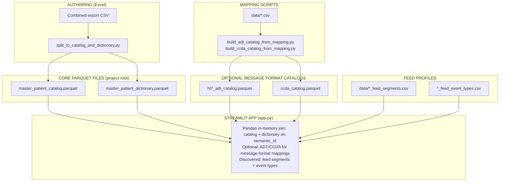
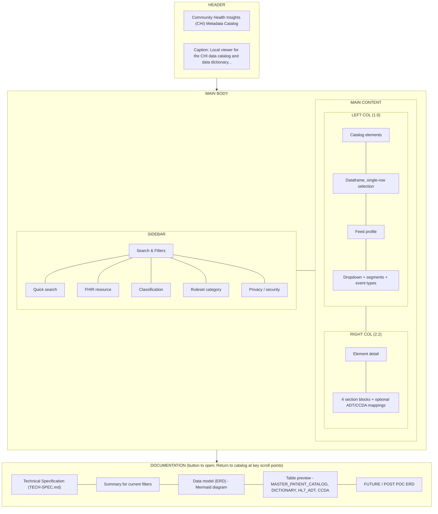

# CHI Metadata Catalog — Technical Specification

This document describes the **architecture strategy**, **architecture itself**, **file and table definitions**, **column schemas**, **test data display**, and **UI layout, organization, and logic** for the chi-data-dictionary-catalog project. It serves as an implementation reference for engineers and maintainers.

For product context (why, who, scope), see **readme-prd.md**. For quick setup, see **README.md**.

---

## Interoperability Staff Quick Guide

This section is written for interoperability, interface, and program staff who are **not** deep data engineers.

- **What this app shows**
  - A **catalog** of patient data elements (one row per element, such as "First name", "Date of birth").
  - A **dictionary** that explains how each element is calculated, where it lives in FHIR, and how survivorship works.
  - Optional views that show **where those elements land in HL7 ADT and CCD/CCDA messages**, and which sources can provide them.

- **How to read one row**
  - **Semantic ID**: the stable name for the concept (for example, `Patient.name_first`). Treat this as the "universal ID" for that data element.
  - **USCDI fields**: three columns grouped together:
    - **USCDI Data Class**: the USCDI bucket (for example, "Patient Demographics").
    - **USCDI Data Element**: the official USCDI technical element name (for example, "Patient Name").
    - **USCDI Element**: the friendly label you see in the app (for example, "First Name").
  - **FHIR path**: where this concept lives in FHIR R4 (for example, `Patient.name.family`). This is how APIs and FHIR interfaces find the data.

- **Three key ideas**
  - **Master vs. messages**: the catalog/dictionary describe the **master truth about the person**. HL7 ADT and CCD/CCDA catalogs only describe **where that truth is carried** in each message format.
  - **Survivorship**: the dictionary explains **which source wins** when feeds disagree (for example, which address or legal name is kept).
  - **Security & consent**: HIPAA, FHIR security labels, and consent columns show **which elements are sensitive** and may need special handling.

If you only need a high-level understanding, you can stop here and use the app. The sections below go into technical detail for engineering and implementation.

---

## HIE Interoperability Maturity

Latest assessment: **2026-03-04** (see **EVALUATION.md** for full domain scoring and rationale).

This section is a rolling summary. Re-evaluate when schema, join logic, interoperability mappings, or regulatory baselines change.

**Exemplary areas (5/5):** Master Data Management, Standards Alignment, Roll-Up Strategy, Address Coherence, Three-Domain Separation, Message Format Separation, Race/Ethnicity Interoperability, Backward Compatibility.

**Implemented in POC (addressing EVALUATION.md gaps):**
- [OK] Stewardship assignment (`data_steward`, `steward_contact`, `approval_status`)
- [OK] Schema versioning (`schema_version`, `last_modified_date`)
- [OK] Identity management (`identifier_type`, `identifier_authority`, `identity_resolution_notes`)
- [OK] Security & consent (`hipaa_category`, `fhir_security_label`, `consent_category`, `de_identification_method`)
- [OK] FHIR compliance (`fhir_must_support`, `fhir_profile`, `fhir_cardinality`)
- [OK] Survivorship enhancements (`tie_breaker_rule`, `conflict_detection_enabled`, `manual_override_allowed`)
- [OK] Data source availability table (links sources to semantic IDs)

**Deferred to production:**
- Field-level provenance tracking (source + timestamp per value) — runtime data, not metadata schema
- Machine-readable source hierarchy — current text format sufficient for POC
- Terminology/value set tables — Domain 3, beyond demographics scope
- Clinical data elements — beyond current POC scope

See **EVALUATION.md** for detailed scoring, compliance assessment (USCDI v4/v5, FHIR US Core, Carequality, CommonWell), and production roadmap.

---

## 1. Architecture Strategy

### 1.1 Why This Architecture Exists

The CHI metadata catalog architecture was designed to address several strategic constraints and goals:

1. **Person-centric vs. message-centric separation** — Master patient attributes (demographics, survivorship) are fundamentally different from message-format specifications (HL7 ADT segments, CCD/CCDA XML paths). Combining them in one schema creates semantic confusion, governance conflicts, and query inefficiency.

2. **Different consumers, different query patterns** — Data engineers building ADT interfaces need message-level specs (segments, fields, event types). Domain SMEs and stewards need person-level attributes (survivorship, source hierarchy). Forcing both into one schema means every query drags irrelevant columns.

3. **Different governance cadences** — HL7 v2 specs change when onboarding a new hospital or partner. Master patient attributes change when survivorship or source hierarchy changes. These should not trigger schema evolution in the same artifact.

4. **Different stewardship models** — Interface engineers own message specs; domain SMEs (e.g., Housing Services, data governance) own patient attributes. Mixing ownership creates approval bottlenecks.

5. **L3 as canonical truth** — The master demographics layer (L3) is the single source of truth. ADT messages, CCDA documents, and FHIR resources are **renderings** of that truth in different formats for different partners. Message catalogs define *where* each attribute lands in each format; they do not duplicate business logic.

### 1.2 Key Design Principles

| Principle | Rationale |
|-----------|-----------|
| **Catalogs are format-specific** | ADT, CCDA, FHIR have fundamentally different structures. Querying "What fields exist in a PID segment?" is different from "What elements exist in a CCDA Social History section?" |
| **Dictionary stays separate from message specs** | L3 survivorship rules are independent of interoperability. Partner-specific rules belong in a crosswalk (future), not the core dictionary. |
| **Link via semantic_id** | The `semantic_id` (e.g., `Patient.name_first`, `Patient.birth_date`) is the universal join key. Master catalog ↔ dictionary is 1:1; master catalog ↔ message catalogs is 1:many. |
| **Crosswalks for output, not input** | Inbound: everyone's data is normalized to L3 using catalog + dictionary. Outbound: L3 is customized per partner using catalogs + crosswalk. |
| **POC scope** | Value-set tables, FHIR catalog, and interoperability crosswalk are strategically deferred. The current POC proves the model with four tables. |

### 1.3 What Was Explicitly Rejected

- **Single unified catalog** — "One metadata catalog to rule them all" fails because different consumers, cadences, and stewards need separation.
- **Forcing HL7 into data_catalog / data_dictionary** — Person-centric and event-centric models were kept separate.
- **Format-specific dictionaries** — For POC, message catalogs carry minimal notes; a unified crosswalk (future) will handle partner rules.

### 1.4 Identity Resolution Strategy

The CHI Master Demographics layer (L3) implements **probabilistic identity resolution** via Verato's Master Patient Index (MPI). The catalog and dictionary support this strategy through several mechanisms:

**Identity Management Columns:**
- `identifier_type` — Taxonomy of identifiers (MRN, SSN, DL, State ID, etc.) for multi-source tracking
- `identifier_authority` — Issuing authority (State of California, SSA, Hospital MRN) for provenance
- `identity_resolution_notes` — Match logic transparency: probabilistic linkage strategy, confidence thresholds, match/no-match rules

**Survivorship for Identity Attributes:**
- Identity attributes (Domain 1) use reliability-based survivorship: hospital-issued legal name ranks higher than self-reported
- Address and contact info use recency-based survivorship (most recent wins)
- `composite_group` ensures name components (first, last, middle) are selected as a set from one source

**Match Confidence and Merge/Unmerge:**
- POC scope: identity resolution is external (Verato). Catalog documents match logic via `identity_resolution_notes`.
- Production scope: add `match_confidence_score` and audit trail for merge/unmerge operations.

---

### 1.5 Security and PHI Handling

The catalog implements **attribute-level security classification** to support HIPAA compliance, 42 CFR Part 2 (substance use disorder), and FHIR security labeling:

**Security and Privacy Columns:**
- `privacy_security` — Legacy PII/Sensitive classification
- `hipaa_category` — HIPAA-specific: "PII" | "PHI" | "SUD_Part2" | "" for regulatory compliance
- `fhir_security_label` — FHIR security labels: "N" (normal), "R" (restricted), "V" (very restricted)
- `consent_category` — Consent requirements: "general" | "research" | "sensitive" for opt-in/opt-out directives
- `de_identification_method` — Strategy for research/public health: "redact" | "suppress" | "generalize" | "pseudonymize"

**Operational Security (Not Metadata Scope):**
- Encryption at rest: AES-256 for Parquet files (deployment concern, not catalog schema)
- Access control: role-based (RBAC) enforcement at application layer
- Audit logging: separate audit table tracks who accessed which semantic_ids when
- Minimum necessary: application filters semantic_ids based on user role and purpose of use

**Consent Directives:**
- POC scope: `consent_category` flags which elements require explicit patient consent
- Production scope: link to FHIR Consent resource for patient opt-in/opt-out tracking

---

### 1.6 HIE Interoperability Alignment (Three-Domain Separation)

The catalog schema aligns with Health Information Exchange (HIE) interoperability best practices and the Master Demographics Three-Domain Separation Strategy:

| Domain | Scope | Catalog Support |
|--------|-------|-----------------|
| **Domain 1: Master Demographics** | Identity attributes, survivorship rules | `classification`, `domain`, `hie_survivorship_logic`, `data_source_rank_reference` |
| **Domain 2: Master Patient Attributes** | Calculated fields (AF/AG housing status), temporal grain | `calculation_grain`, `historical_freeze`, `recalc_window_months`, `granularity_level` |
| **Domain 3: Clinical Governance** | Terminology mapping, value sets | `fhir_r4_path`, `fhir_data_type`; value-set tables (future). USCDI v4 is the baseline for data classes and elements referenced in `uscdi_*` columns. |

**Additional HIE alignment:**

- **Roll-up vs. detail** — `rollup_relationship`, `is_rollup` for race, ethnicity, language, etc. (detailed elements point to rollup parent).
- **Address coherence** — `composite_group` ensures street, city, zip are selected as a set from one source at one timestamp.
- **Source hierarchy** — `data_source_rank_reference` documents attribute-specific rules (e.g., address: recency; legal name: reliability).
- **Governance & stewardship** — `data_steward`, `steward_contact`, `approval_status` for ownership transparency.
- **Identity management** — `identifier_type`, `identifier_authority` for multi-source identity tracking; `identity_resolution_notes` for match logic.
- **Security & consent** — `hipaa_category`, `fhir_security_label`, `consent_category` for HIPAA/42 CFR Part 2 compliance and attribute-level consent directives.
- **FHIR compliance** — `fhir_must_support`, `fhir_profile`, `fhir_cardinality` for US Core validation.
- **Survivorship enhancements** — `tie_breaker_rule`, `conflict_detection_enabled`, `manual_override_allowed` for conflict resolution.
- **Data source linkage** — `data_source_availability.parquet` table links feed profiles to catalog elements for intelligent source selection.

**Deferred (P2):** Formal machine-readable `data_source_rank_reference` structure (current: human-readable text); field-level provenance tracking (source_system_id + timestamp per value).

---

### 1.7 Terminology & Value Sets — Practical Implementation (DAP as System of Record)

The CHI metadata catalog is **not** intended to re-host full clinical code systems (ICD-10-CM, SNOMED CT, LOINC, RxNorm) or enterprise value sets.
Those artifacts already exist and are governed within the **Innovaccer DAP platform**, which remains the **system of record** for terminology.

**Design decision (practical scope):**

- **Enterprise terminology & value sets live in DAP.**
  - CHI does not duplicate full ICD-10/SNOMED/LOINC catalogs in local Parquet tables.
  - DAP’s terminology services and value-set registries are authoritative for clinical codes.

- **CHI catalog/dictionary reference DAP, they do not replace it.**
  - When a `semantic_id` is bound to a code system or value set, the dictionary may carry:
    - A reference identifier (e.g., `dap_value_set_id`, `canonical_concept_id`) rather than a full local copy.
    - Local governance notes about how CHI uses that value set (e.g., AF/AG-specific interpretation).
  - Future crosswalk and code-mapping tables (e.g., `CODE_MAPPING`, `interoperability_crosswalk.parquet`) are
    expected to reference DAP concepts/values, not define global truth.

- **Local tables are used only for CHI-specific overlays.**
  - If CHI needs a **local extension** that DAP does not manage (e.g., pilot-only AF/AG codes, county-specific
    reporting codes), those can be modeled as small local tables that:
    - Reference DAP concepts where possible.
    - Are explicitly documented as CHI-local overrides or temporary mappings.

This keeps the effort **practical and operational**:

- DAP remains the single source of truth for clinical codes and enterprise value sets.
- The CHI metadata catalog focuses on **how CHI uses those terminologies** (bindings, governance, crosswalk rules),
  not on duplicating terminology content.

---

### 1.8 Semantic ID Naming Convention

`semantic_id` is the **canonical join key** across this architecture. It is designed to be:

- **Person / concept-centric**, not format-centric.
- **Stable over time**, even if underlying message formats or storage schemas change.
- **Human-readable** for stewards, architects, and interface engineers.

**Foundations:**

- Concepts are primarily drawn from **USCDI** and modeled using **FHIR R4** resources and elements
  (e.g., `Patient`, `Observation`, `Encounter`).
- `semantic_id` values use a **CHI-specific naming convention** on top of those standards:
  - Pattern: `Resource.element_subpart` (e.g., `Patient.name_first`, `Patient.name_last`, `Patient.address_street`).
  - Business-friendly terms (`name_first`, `name_last`) instead of raw FHIR tokens (`given[0]`, `family`).
- `fhir_r4_path` records the exact FHIR binding (e.g., `Patient.name.family`) separately from `semantic_id`.

**Intentional non-use of HL7 segment/field names:**

- `semantic_id` **never uses HL7 v2 segment/field identifiers** (`PID-5`, `PV1-2`, etc.).
- HL7 ADT fields are documented in `hl7_adt_catalog.parquet` and linked to `semantic_id`, but `semantic_id` itself
  remains **agnostic to message formats**.

**Why this matters:**

- `semantic_id` acts as a **format-independent anchor**:
  - Catalog/dictionary survivorship and governance rules live at the `semantic_id` level.
  - Message catalogs (ADT/CCDA) map their segment/field/XPath locations back to `semantic_id`.
  - Crosswalks (future) will use `semantic_id` as the stable key when defining partner-specific rules.
- This allows CHI to:
  - Change how an element is rendered in ADT, CCDA, or FHIR **without renaming the semantic_id**.
  - Support multiple message formats in parallel without leaking format-specific details into the core model.

---

## 2. Architecture

### 2.1 High-Level Data Flow

### 2.2 File and Directory Layout

| Location | Content |
|----------|---------|
| **Project root** | `app.py`, Parquet files, README, docs |
| **master_patient_catalog.parquet** | Required. Catalog view. |
| **master_patient_dictionary.parquet** | Required. Dictionary view. |
| **hl7_adt_catalog.parquet** | Optional. ADT field mappings. |
| **ccda_catalog.parquet** | Optional. CCD/CCDA XML mappings. |
| **data_source_availability.parquet** | Optional. Source-to-semantic_id availability matrix. |
| **scripts/** | `split_to_catalog_and_dictionary.py`, `build_adt_catalog_from_mapping.py`, `build_ccda_catalog_from_mapping.py`, `build_data_source_availability.py` |
| **data/** | Mapping CSVs, feed profiles (segments, event types) |
| **docs/** | `adding-data-sources.md`, `cmt-adt-feed-and-master-patient.md`, `jupyter-duckdb-parquet-setup.md` |

### 2.3 Entity-Relationship (POC)

- **MASTER_PATIENT_CATALOG** ↔ **MASTER_PATIENT_DICTIONARY**: 1:1 on `semantic_id`
- **MASTER_PATIENT_CATALOG** → **HL7_ADT_CATALOG**: 1:many (one element can map to multiple ADT fields)
- **MASTER_PATIENT_CATALOG** → **CCDA_CATALOG**: 1:many (one element can map to multiple CCD/CCDA locations)
- **MASTER_PATIENT_CATALOG** → **DATA_SOURCE_AVAILABILITY**: 1:many (one element can be provided by multiple sources)

---

## 3. File and Table Definitions

### 3.1 Core Tables (Required)

#### MASTER_PATIENT_CATALOG (`master_patient_catalog.parquet`)

**Purpose:** Defines **what elements exist** and how they are grouped. One row per data element. Answers: *What attributes does CHI track?*

**Grain:** One row per `semantic_id` (primary key).

**Source:** Produced by `scripts/split_to_catalog_and_dictionary.py` from a combined Excel export CSV.

---

#### MASTER_PATIENT_DICTIONARY (`master_patient_dictionary.parquet`)

**Purpose:** Defines **what each element means** and **how it is implemented**. Survivorship rules, FHIR mapping, data quality notes. Answers: *How do we determine the golden value? Where does it live in FHIR?*

**Grain:** One row per `semantic_id` (foreign key to catalog).

**Source:** Same split script. Historical note: Excel column "SHIE Survivorship Logic" becomes `hie_survivorship_logic` in Parquet.

---

### 3.2 Optional Message-Format Catalogs

#### HL7_ADT_CATALOG (`hl7_adt_catalog.parquet`)

**Purpose:** Maps master patient elements to **HL7 ADT message structure**. Each row describes where a `semantic_id` appears in ADT messages (segment, field, data type, optionality).

**Grain:** One row per (segment_id, field_id, semantic_id) combination. One semantic_id can have multiple rows (e.g., PID-5.1 and PID-5.2 both map to name elements).

**Source:** Built by `scripts/build_adt_catalog_from_mapping.py` from `data/l2_to_semantic_id_mapping.csv`.

---

#### CCDA_CATALOG (`ccda_catalog.parquet`)

**Purpose:** Maps master patient elements to **CCD/CCDA XML structure**. Each row describes where a `semantic_id` appears in CCD/CCDA documents (section, entry type, XML path).

**Grain:** One row per (section_name, entry_type, xml_path, semantic_id) combination.

**Source:** Built by `scripts/build_ccda_catalog_from_mapping.py` from `data/ccd_to_semantic_id_mapping.csv`.

---

### 3.3 Source Data and Feed Profiles

#### Mapping CSVs (inputs to build scripts)

| File | Purpose | Consumed By |
|------|---------|-------------|
| **data/l2_to_semantic_id_mapping.csv** | L2 column → semantic_id, FHIR path; HL7 segment/field | `build_adt_catalog_from_mapping.py` |
| **data/ccd_to_semantic_id_mapping.csv** | CCD section, entry type, XML path → semantic_id | `build_ccda_catalog_from_mapping.py` |

#### Feed Profiles (source-specific, not message-format)

| Pattern | Purpose | Consumed By |
|---------|---------|-------------|
| **data/&lt;source_id&gt;_feed_segments.csv** | Segment availability for a data source (e.g., CMT ADT) | App discovers via `*_feed_segments.csv` |
| **data/&lt;source_id&gt;_feed_event_types.csv** | Event type distribution (A01, A03, A08, etc.) | Same discovery |
| **data/datasource_counts_by_account.csv** | Record counts by account/period | Reference only; no UI yet |

---

## 4. Column Schemas

### 4.1 MASTER_PATIENT_CATALOG

| Column | Type | Description |
|--------|------|-------------|
| `semantic_id` | string | Primary key. Canonical identifier (e.g., `Patient.name_first`, `Patient.birth_date`). |
| `uscdi_element` | string | Human-readable element name (e.g., "First Name"). |
| `uscdi_description` | string | Description of the element. |
| `uscdi_data_class` | string | USCDI v4 **Data Class** (e.g., "Patient Demographics", "Clinical Notes"). Optional; used when aligning elements to specific USCDI classes. |
| `uscdi_data_element` | string | USCDI v4 **Data Element** technical name (e.g., "Patient Name", "Date of Death"). Optional; used as the USCDI-aligned technical element name. |
| `classification` | string | Grouping (e.g., "Master Demographics", "SDOH"). |
| `domain` | string | **HIE Three-Domain Separation.** Governance boundary: "Domain 1: Master Demographics" \| "Domain 2: Master Patient Attributes" \| "Domain 3: Clinical Governance". |
| `ruleset_category` | string | Ruleset (e.g., "Static Identity", "Dynamic Identity"). |
| `privacy_security` | string | PII/Sensitive flags if applicable. |
| `hipaa_category` | string | **HIPAA classification.** "PII" \| "PHI" \| "SUD_Part2" \| "" for HIPAA/42 CFR Part 2 compliance. |
| `fhir_security_label` | string | **FHIR security label.** "N" (normal), "R" (restricted), "V" (very restricted) per FHIR security labeling. |
| `consent_category` | string | **Consent requirement.** "general" \| "research" \| "sensitive" for consent directive mapping. |
| `rollup_relationship` | string | **HIE roll-up vs. detail.** Parent semantic_id for detailed elements (e.g., `Patient.race_rollup`). NULL for rollups. |
| `is_rollup` | string | **HIE roll-up vs. detail.** "true" for rollup categories, "false" for detailed. |
| `composite_group` | string | **HIE address coherence.** Group identifier for survivorship-as-set (e.g., `Patient.address`). Elements with same value must be selected together from one source at one timestamp. |
| `identifier_type` | string | **Identity management.** Identifier type taxonomy (e.g., "MRN", "SSN", "DL", "State_ID") for multi-source identity tracking. |
| `identifier_authority` | string | **Identity management.** Issuing authority (e.g., "State_of_California", "SSA", "Hospital_MRN") for identifier provenance. |
| `data_steward` | string | **Governance.** Name of data steward responsible for this element. |
| `steward_contact` | string | **Governance.** Contact information (email, Slack) for data steward. |
| `approval_status` | string | **Governance.** Approval workflow state: "draft" \| "review" \| "approved" \| "deprecated". |
| `schema_version` | string | **Versioning.** Schema version for this element (e.g., "1.0", "2.1"). |
| `last_modified_date` | string | **Versioning.** ISO 8601 date of last modification (e.g., "2026-03-04"). |

**Derived in app:** `fhir_resource` = first token of `fhir_r4_path` (e.g., `Patient.name.given` → `Patient`).

**USCDI vs FHIR mapping (concept vs representation):**

- `uscdi_element`, `uscdi_data_class`, and `uscdi_data_element` capture **USCDI v4 concepts** (what must be exchanged), independent of any specific format.
- `fhir_r4_path`, `fhir_profile`, `fhir_cardinality`, and `fhir_must_support` (in the dictionary) capture **how those concepts are represented in FHIR R4 / US Core**.
- This separation keeps USCDI usage **format-agnostic** while still documenting the FHIR implementation details needed for APIs and exchange.

---

### 4.2 MASTER_PATIENT_DICTIONARY

| Column | Type | Description |
|--------|------|-------------|
| `semantic_id` | string | Primary key, FK to catalog. |
| `hie_survivorship_logic` | string | HIE survivorship rule text. |
| `tie_breaker_rule` | string | **Survivorship enhancement.** Tie-breaker when sources have equal rank: "most_recent" \| "most_complete" \| "source_reliability_score". |
| `conflict_detection_enabled` | string | **Survivorship enhancement.** "true" \| "false" for logging when sources disagree. |
| `manual_override_allowed` | string | **Survivorship enhancement.** "true" \| "false" for steward intervention capability. |
| `data_source_rank_reference` | string | Source hierarchy / rank reference. Attribute-specific rules can use structured text: "For address: HMIS > Hospital. For legal name: Hospital > HMIS." |
| `identity_resolution_notes` | string | **Identity management.** Match logic transparency: probabilistic linkage strategy, confidence thresholds, match/no-match rules. |
| `coverage_personids` | string | Coverage metric (e.g., # of person IDs). |
| `granularity_level` | string | Granularity of the element. |
| `calculation_grain` | string | **HIE temporal (Domain 2).** "monthly" \| "daily" \| "real-time" for calculated attributes (e.g., AF/AG housing status). |
| `historical_freeze` | string | **HIE temporal (Domain 2).** "true" if past values are immutable (e.g., Jan 2023 stays frozen). |
| `recalc_window_months` | string | **HIE temporal (Domain 2).** Rolling recalculation window (e.g., "3" for last 3 months). NULL for static attributes. |
| `innovaccer_survivorship_logic` | string | Innovaccer-specific survivorship logic. |
| `data_quality_notes` | string | Quality and governance notes. |
| `de_identification_method` | string | **Privacy.** De-identification strategy: "redact" \| "suppress" \| "generalize" \| "pseudonymize" for research/public health use. |
| `fhir_r4_path` | string | Canonical FHIR R4 path (e.g., `Patient.name.given`). |
| `fhir_data_type` | string | FHIR data type for the element. |
| `fhir_profile` | string | **FHIR compliance.** US Core or other profile URL (e.g., "http://hl7.org/fhir/us/core/StructureDefinition/us-core-patient"). |
| `fhir_cardinality` | string | **FHIR compliance.** Cardinality constraint: "0..1" \| "1..1" \| "0..\*" \| "1..\*". |
| `fhir_must_support` | string | **FHIR compliance.** "true" if US Core Must Support element; "false" otherwise. |

---

### 4.3 HL7_ADT_CATALOG

| Column | Type | Description |
|--------|------|-------------|
| `message_format` | string | Always `"ADT"`. |
| `message_type` | string | ADT event (e.g., `A01`, `A03`, `A08`). |
| `segment_id` | string | HL7 segment (e.g., `PID`, `PV1`). |
| `field_id` | string | HL7 field (e.g., `PID-5`, `PID-7`). |
| `field_name` | string | Human-readable field name. |
| `data_type` | string | HL7 v2 data type (e.g., `ST`, `NM`, `XPN`). |
| `optionality` | string | `R` (required), `O` (optional), `C` (conditional). |
| `cardinality` | string | Repetitions (e.g., `1`, `0..*`). |
| `semantic_id` | string | FK to master catalog. |
| `fhir_r4_path` | string | Equivalent FHIR path. |
| `notes` | string | Implementation or data-quality notes. |

---

### 4.4 CCDA_CATALOG

| Column | Type | Description |
|--------|------|-------------|
| `message_format` | string | Always `"CCD"`. |
| `section_name` | string | CCD section (e.g., "Demographics", "Participants"). |
| `entry_type` | string | Entry type (e.g., "First Name", "Date of Birth"). |
| `xml_path` | string | Representative XPath in CCD/CCDA XML. |
| `semantic_id` | string | FK to master catalog. |
| `fhir_r4_path` | string | Equivalent FHIR path. |
| `notes` | string | Implementation notes. |

---

### 4.5 DATA_SOURCE_AVAILABILITY

**Purpose:** Links data sources (feed profiles) to catalog semantic IDs, documenting which sources can provide which attributes. Supports intelligent source selection for survivorship and enables data quality tracking per source per attribute.

**Grain:** One row per (source_id, semantic_id) combination.

**Source:** Built by `scripts/build_data_source_availability.py` from discovered feed profiles and master catalog.

| Column | Type | Description |
|--------|------|-------------|
| `source_id` | string | Data source identifier (e.g., "cmt", "sutter"). Matches `*_feed_segments.csv` naming. |
| `semantic_id` | string | FK to master catalog. |
| `availability` | string | "full" \| "partial" \| "none" \| "unknown". Indicates whether source provides this attribute. |
| `completeness_pct` | string | Estimated completeness percentage (0.0-100.0). Empty in POC; production would profile feed data. |
| `timeliness_sla_hours` | string | Expected data freshness SLA in hours. Empty in POC. |
| `notes` | string | Source-specific notes (e.g., "Only available for inpatient encounters"). |

**POC Note:** Current implementation creates placeholder rows with `availability="unknown"`. Production implementation would analyze actual feed data to compute real completeness and timeliness metrics.

---

### 4.6 Feed Profile CSVs

**&lt;source_id&gt;_feed_segments.csv**

| Column | Type | Description |
|--------|------|-------------|
| `segment_id` | string | HL7 segment (e.g., `PID`, `PV1`). |
| `data_received` | string | `Y` or `N` (whether this source sends it). |
| `notes` | string | Optional notes. |

**&lt;source_id&gt;_feed_event_types.csv**

| Column | Type | Description |
|--------|------|-------------|
| `event_type` | string | ADT event (e.g., `A01`, `A08`). |
| `file_count` | string | Count of files. |
| `percentage_of_total` | string | % of total volume. |
| `description` | string | Human-readable description. |

---

### 4.7 Combined CSV (input to split script)

Expected columns (Excel headers; script normalizes and converts to snake_case):

**Catalog:** Semantic ID, USCDI Element, USCDI Description, USCDI Data Class, USCDI Data Element, Classification, Ruleset Category, Privacy/Security

**Dictionary:** Semantic ID, SHIE Survivorship Logic, Data Source Rank Reference, Coverage (# PersonIDs), Granularity Level, Innovaccer Survivorship Logic, Data Quality Notes, FHIR R4 Path, FHIR Data Type

---

## 5. Test Data Display

### 5.1 Joined View (App Main Dataframe)

The app joins catalog + dictionary on `semantic_id` and derives `fhir_resource`. Columns displayed or used:

| Column | In List View | In Detail View | In Filters |
|--------|--------------|----------------|------------|
| `semantic_id` | ✓ (as "Semantic ID") | ✓ | Search |
| `uscdi_element` | ✓ (as "Element") | ✓ | Search |
| `fhir_resource` | ✓ (as "Resource") | ✓ (derived) | Multiselect |
| `uscdi_description` | — | ✓ | Search |
| `uscdi_data_class` | — | ✓ | — |
| `uscdi_data_element` | — | ✓ | — |
| `classification` | — | ✓ | Multiselect |
| `ruleset_category` | — | ✓ | Multiselect |
| `privacy_security` | — | ✓ | Multiselect |
| `fhir_r4_path` | — | ✓ | Search |
| `fhir_data_type` | — | ✓ | — |
| `hie_survivorship_logic` | — | ✓ | — |
| `innovaccer_survivorship_logic` | — | ✓ | — |
| `data_source_rank_reference` | — | ✓ | — |
| `coverage_personids` | — | ✓ | — |
| `granularity_level` | — | ✓ | — |
| `data_quality_notes` | — | ✓ | — |

### 5.2 Message-Format Mappings (Detail View)

When ADT or CCDA catalogs exist and contain rows for the selected `semantic_id`:

**ADT table columns:** semantic_id, message_type, segment_id, field_id, field_name, notes

**CCDA table columns:** semantic_id, section_name, entry_type, xml_path, notes

### 5.3 Empty or Missing Values

Displayed as **—** (em dash). Multiline fields (Description, survivorship logic, etc.) use a scrollable box with min/max height.

---

## 6. UI Layout, Organization, and Logic

### 6.1 Page Structure

### 6.2 Sidebar: Search & Filters

- **Quick search:** Free-text, case-insensitive. Searches `semantic_id`, `uscdi_element`, `uscdi_description`, `fhir_r4_path`, `domain`, `composite_group`. Updates results as user types.
- **FHIR resource:** Multiselect. Options derived from `fhir_resource` (Patient, Observation, etc.).
- **Classification:** Multiselect (e.g., Master Demographics, SDOH).
- **Domain:** Multiselect (e.g., Domain 1: Master Demographics, Domain 2: Master Patient Attributes). HIE Three-Domain Separation.
- **Ruleset category:** Multiselect (e.g., Static Identity, Dynamic Identity).
- **Privacy / security:** Multiselect for PII/sensitive flags.

**Logic:** All filters are ANDed. Empty multiselects = no filter on that dimension. Search is OR across the text columns.

### 6.3 Left Column: Catalog Elements

- **Dataframe:** Columns Semantic ID, Element, Resource. `selection_mode="single-row"`, `on_select="rerun"`.
- **Selection:** First selected row, or row 0 if none. Selected row drives the detail view.
- **Feed profile:** Dropdown lists sources (e.g., "CMT feed profile") discovered from `data/*_feed_segments.csv`. Selecting a source shows:
  - **Segments:** Dataframe with segment_id, data_received, notes, link_segment_id.
  - **Event types:** Dataframe with event_type, file_count, % of total, description, link_segment_id (event-level marker).

### 6.4 Right Column: Element Detail

Single, vertically stacked layout (no tabs). Four section blocks with distinct background tints:

| Section | CSS Class | Caption | Fields |
|---------|-----------|---------|--------|
| **Catalog** | section-catalog (#f9fafb) | from master_patient_catalog.parquet | Semantic ID, USCDI Data Class, USCDI Data Element, USCDI Element, Description, Classification, Domain, Ruleset Category, Privacy/Security, HIPAA Category, FHIR Security Label, Consent Category, Rollup Relationship, Is Rollup, Composite Group, Identifier Type, Identifier Authority, Data Steward, Steward Contact, Approval Status, Schema Version, Last Modified Date |
| **Dictionary – FHIR Mapping** | section-fhir (#ecfdf5) | Canonical FHIR R4 path & type | Resource, FHIR Path, FHIR Data Type, FHIR Profile, FHIR Cardinality, FHIR Must Support |
| **Dictionary – Survivorship & Sources** | section-survivorship (#fffbeb) | Business rules and source logic | HIE Survivorship Logic, Tie Breaker Rule, Conflict Detection Enabled, Manual Override Allowed, Innovaccer Survivorship Logic, Data Source Rank Reference, Identity Resolution Notes, Coverage (# PersonIDs), Granularity Level, Calculation Grain, Historical Freeze, Recalc Window (Months) |
| **Dictionary – Quality & Governance** | section-quality (#f5f3ff) | — | Quality & Governance Notes, De-identification Method |

Multiline fields (Description, survivorship logic, Data Source Rank Reference, Quality & Governance Notes) use `field-value-multiline` (scrollable, ~3–6 lines).

**Message-format mappings** (conditional): If ADT or CCDA catalog has rows for the selected `semantic_id`, show:
- **HL7 ADT** block (#eff6ff): Dataframe with message_type, segment_id, field_id, field_name, notes.
- **CCD / CCDA** block (#f0fdf4): Dataframe with section_name, entry_type, xml_path, notes.

### 6.5 Documentation Section

The documentation is session-state-driven (not an expander). A button opens the full section; **"↑ Return to catalog"** buttons at key scroll points collapse it and return focus to the main UI.

- **Open:** Click **"Documentation — Summary, ERD, table preview, TECH-SPEC"** to reveal the section.
- **Technical Specification:** Full TECH-SPEC.md with Mermaid diagrams (2.1 Data Flow, 6.1 Page Structure) rendered inline.
- **Summary:** Total elements, distinct FHIR resources, with/without FHIR mapping, missing survivorship, PII count.
- **ERD:** Mermaid diagram (embedded via components.v1.html or fallback code block).
- **Table preview:** Raw Parquet preview for all four tables; row limit selector (50, 500, "5 trillion").
- **FUTURE / POST POC:** Extended ERD with value-set tables, FHIR catalog, crosswalk.
- **Return to catalog:** Buttons at top, after Technical Specification, after ERD, and at bottom.

### 6.6 Theme and Styling

- **Background:** #f3f4f6 (main), #e5e7eb (sidebar).
- **Accent:** #047857 / #059669 (medical green).
- **Typography:** System fonts (-apple-system, Segoe UI, Roboto).
- **Labels:** 7.5rem min-width, right-aligned; secondary color #4b5563.
- **Value boxes:** White background, 1px #d1d5db border, 4px radius.

### 6.7 Data Loading Logic

1. `load_data()`: Pandas-based merge of catalog + dictionary on `semantic_id`, with schema tolerance for HIE alignment columns. Cached (`@lru_cache(maxsize=1)`).
2. `load_message_catalogs()`: Optional ADT and CCDA Parquet. Cached.
3. `load_all_feed_profiles()`: Discovers `data/*_feed_segments.csv`, derives source_id, loads matching `*_feed_event_types.csv`. Cached.
4. `load_five_tables_for_review()`: Loads all tables (catalog, dictionary, ADT, CCDA, data source availability) for documentation preview. Cached.
5. Filters applied in `apply_filters(df)`; filtered dataframe drives list and detail.

### 6.8 Error Handling

- Missing required Parquet: `FileNotFoundError` → `st.error()` + `st.stop()`.
- Empty filter result: `st.info("No elements match...")`.
- Optional catalogs: Graceful absence (ADT/CCDA blocks not shown if no data).

### 6.9 Mermaid Diagram Rendering (Streamlit Cloud)

Mermaid diagrams (Data Flow, Page Structure, ERD) are rendered via `st.components.v1.html()` with mermaid.js. **Do not place Mermaid content inside nested or collapsed expanders.** On Streamlit Cloud, iframes for diagram content that are lazily rendered (e.g., inside `st.expander(..., expanded=False)`) can fail to initialize mermaid properly. Keep all Mermaid diagrams in the same DOM context as the main Documentation content — i.e., render them directly in the flow, not inside a second-level expander. This constraint was discovered when TECH-SPEC diagrams inside a "View full TECH-SPEC.md" expander failed to render; removing the nested expander resolved it.

---

## 7. Pipeline Summary

| Step | Command / Action | Output |
|------|-----------------|--------|
| 1. Author | Edit Excel, export combined CSV | `combined_export.csv` |
| 2. Split | `python scripts/split_to_catalog_and_dictionary.py combined_export.csv` | `master_patient_catalog.parquet`, `master_patient_dictionary.parquet` |
| 2b. Upgrade (existing Parquet) | `python scripts/split_to_catalog_and_dictionary.py --upgrade-schema -d .` | Adds HIE alignment columns to existing Parquet |
| 3. ADT catalog (optional) | `python scripts/build_adt_catalog_from_mapping.py` | `hl7_adt_catalog.parquet` |
| 4. CCDA catalog (optional) | `python scripts/build_ccda_catalog_from_mapping.py` | `ccda_catalog.parquet` |
| 5. Data source availability | `python scripts/build_data_source_availability.py` | `data_source_availability.parquet` |
| 6. Run app | `streamlit run app.py` | Local Streamlit UI |

---

## 8. Related Documents

| Document | Purpose |
|----------|---------|
| **readme-prd.md** | Executive PRD; problem, scope, success criteria |
| **README.md** | Quick start, setup, files of interest |
| **hl7_ccd_fhir_consideration.md** | Strategic analysis: HL7/CCD architecture, L0–L6 flow, crosswalks |
| **ccd_interface_mapping.md** | CCD → Innovaccer (INV) reference mapping |
| **data/README.md** | Data artifacts overview |
| **docs/adding-data-sources.md** | How to add feed profiles |
| **docs/cmt-adt-feed-and-master-patient.md** | CMT ADT and Master Patient alignment |
| **docs/jupyter-duckdb-parquet-setup.md** | Jupyter + DuckDB setup |
