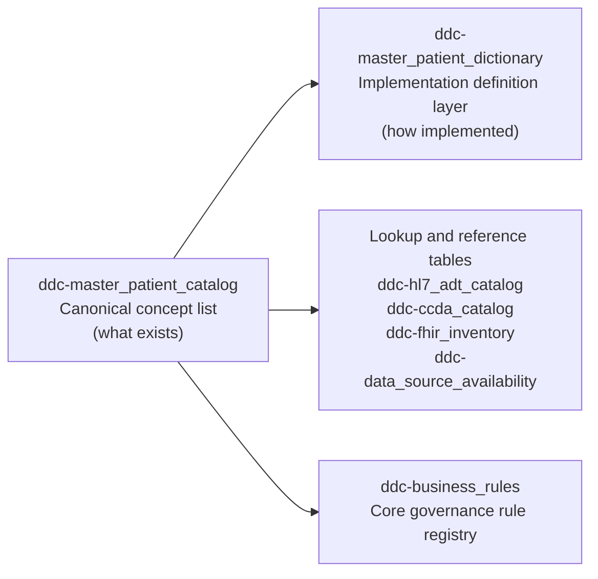

# Airtable Integration Setup (Node + MCP)

This repo can be used with Airtable via a Node-based integration layer (for example, an MCP server that shells out to `npx`).

This document records what we did so the setup can be reproduced and troubleshooting can be done quickly.

---

## What we changed in this repo

1. Installed Node.js runtime (Node LTS) on the machine.
2. Initialized a Node project in the repo root:
   - Created `package.json`
3. Installed the Node dependencies:
   - `airtable`
   - `dotenv`
4. Created `package-lock.json` and populated `node_modules/`.

Files added/updated:
- `package.json`
- `package-lock.json`
- `node_modules/` (local)
- `docs/airtable-setup.md` (this file)

---

## Prerequisites

1. Node.js must be installed on the machine.
2. `node` and `npx` must be discoverable in the *same terminal session* where the integration (MCP server, scripts, etc.) is launched.

Quick checks:
```powershell
node -v
npx -v
```

---

## MCP Airtable server package (Cursor)

Cursor launches the Airtable MCP server using your MCP config:

- `C:\Users\<you>\.cursor\mcp.json`

In the working configuration, Cursor uses:

- `command`: `npx`
- `args`: `-y airtable-mcp-server`

If you see errors like:
- `npm error 404 Not Found - GET .../@modelcontextprotocol/server-airtable ...`

then your MCP config is pointing to a non-existent package name. Update it to use `airtable-mcp-server` (and keep `AIRTABLE_API_KEY` set in the `env` block).

---

## Repo commands you can re-run

From the repo root (`C:\AI\chi-data-dictionary-catalog`):
```powershell
npm init -y
npm install airtable dotenv
```

---

## Environment variables (placeholders)

For any Airtable API usage, you typically need at least:

- `AIRTABLE_API_KEY` (your Airtable Personal Access Token)
- `AIRTABLE_BASE_ID` (the base id)
- (optional) `AIRTABLE_TABLE_NAME` or mapping configuration for your target table

Example `.env` (do not commit real secrets):
```text
AIRTABLE_API_KEY=YOUR_TOKEN_HERE
AIRTABLE_BASE_ID=appXXXXXXXXXXXXXX
AIRTABLE_TABLE_NAME=YourTableName
```

---

## Known issue: `npx` not found (`spawn npx ENOENT`)

What happened:
- Node was installed, but an already-open process/terminal still had an old `PATH`, so `npx` could not be found.

Fix:
1. Open a *fresh* PowerShell terminal after Node installation, OR
2. Restart Cursor / reload the MCP tool so it spawns new processes with the updated `PATH`.

If you want to confirm the executable location:
```powershell
where.exe node
where.exe npx
```

---

## Known issue: MCP Airtable server package not found (npm 404)

Symptoms (Cursor Output / MCP logs):
- `npm error 404 Not Found - GET .../@modelcontextprotocol%2fserver-airtable ...`

Cause:
- Your Cursor MCP config is pointing to a package name that does not exist on npm.

Fix:
- In `C:\Users\<you>\.cursor\mcp.json`, set the Airtable MCP server args to:
  - `args`: `["-y", "airtable-mcp-server"]`
- Restart Cursor so it re-reads the MCP config.

---

## Current scope status (important)

This setup ensures the repo has the Node runtime and Airtable SDK dependencies required for an Airtable integration.

It also includes a re-runnable uploader script (Question #2): `scripts/upload_parquet_to_airtable.py`.
It upserts your local `ddc-*` Parquet into the corresponding `ddc-*` Airtable tables, and it can optionally create/populate Link/Relation fields so navigation mirrors canonical `semantic_id` joins.

---

## Parquet upload to Airtable (Question #2)

### What it uploads
The script upserts these local Parquet files (project root) into your Airtable Base:
- `ddc-master_patient_catalog.parquet` -> `ddc-master_patient_catalog`
- `ddc-master_patient_dictionary.parquet` -> `ddc-master_patient_dictionary`
- `ddc-hl7_adt_catalog.parquet` -> `ddc-hl7_adt_catalog` (optional support table)
- `ddc-ccda_catalog.parquet` -> `ddc-ccda_catalog` (optional support table)
- `ddc-data_source_availability.parquet` -> `ddc-data_source_availability`

All table names are `ddc-*` (no `.parquet` suffix), matching what you created in Airtable.

**Display vs sync identity (1.0):** The uploader sets **`Name`** to a human-readable label and writes **`upsert_key`** with the stable composite key used for matching. For `ddc-hl7_adt_catalog`, `Name` is intentionally compact (`field_id | semantic_id`) so stewards can scan HL7 locators quickly. Upsert logic still keys off the underlying columns (not `Name`). Catalog links use **`semantic_id`**. See **TECH-SPEC.md §6.7.1**.

### How to run it
From the repo root:

```powershell
.venv\Scripts\activate
python scripts\upload_parquet_to_airtable.py
```

### Add Link/Relation fields (your “Yes to both” request)
This flag creates and populates a Link/Relation field that points each non-catalog row back to the matching catalog row using `semantic_id`.

```powershell
python scripts\upload_parquet_to_airtable.py --add-relations
```

Relation field created/populated:
- `catalog_element` (Link/Relation -> `ddc-master_patient_catalog`)

### Token / environment
The script reads `AIRTABLE_API_KEY` from:
- environment variable `AIRTABLE_API_KEY` (recommended), or
- Cursor MCP config (`~/.cursor/mcp.json`) as a fallback.

Optional portability settings:
- `AIRTABLE_BASE_ID` can be set in the environment instead of passing `--base-id`.
- `--base-dir` can be used if the parquet artifacts are not in the repo root next to `scripts/`.
- `--mcp-config-path` can be used when the fallback MCP config is stored outside the default Cursor location.

If you want the script to be portable across machines, set `AIRTABLE_API_KEY` explicitly before running.

---

## Airtable Steward Workflow

### Airtable's role in the operating model

Use the current implementation as a **3-layer model**:

- **Layer 1: partner intake** stays outside the steward base.
  - Source inventories, local code capture, and relationship notes should be collected in intake workbooks or equivalent source documents.
- **Layer 2: CHI governance** is the controlled semantic layer.
  - Parquet artifacts and the synced `ddc-*` governance tables hold the curated semantic model.
- **Layer 3: Airtable stewardship** is the working interface.
  - Airtable is where stewards browse, triage, review, and manage readiness over the governed model.

This means the current base is intentionally **not** trying to be the partner intake workbook and should not be treated as the only place where semantic logic lives.

---

## Airtable Curation Workflow (primary detail view)

### Canonical vs implementation vs reference layers

Use this model when deciding which tables are actively stewarded versus periodically refreshed.



Operational interpretation:
- Core governance: `ddc-master_patient_catalog`, `ddc-master_patient_dictionary`, `ddc-business_rules`
- Interoperability lookup/reference: `ddc-hl7_adt_catalog`, `ddc-ccda_catalog`, `ddc-fhir_inventory`
- Operational reference: `ddc-data_source_availability`

---

### What stewards edit (editable group)
- Governance fields in `ddc-master_patient_catalog` for the selected `semantic_id`, such as:
  - `approval_status`, `reviewer_notes`, `data_steward`, `steward_contact`
- Implementation and standards fields in `ddc-master_patient_dictionary` (for the selected `semantic_id`), such as:
  - `fhir_r4_path`, `fhir_data_type`, `fhir_profile`, `fhir_must_support`
  - `chi_survivorship_logic`, `tie_breaker_rule`, `conflict_detection_enabled`
  - `identity_resolution_notes`, `de_identification_method`
- Rule records in `ddc-business_rules` when organization-specific logic needs explicit rule lifecycle tracking.
- Steward workflow fields:
  - `curation_status` (string; e.g. `Needs Action`, `In Progress`, `Ready for Review`)
  - `steward_assigned_to`
  - `steward_action_notes`

### FHIR R4 curation QA queue signals (auto-populated)
For each `semantic_id`, the uploader computes FHIR R4 readiness based on whether key FHIR mapping columns are populated:
- `fhir_r4_mapping_readiness`
  - `Complete` when all required FHIR mapping fields are present
  - `Needs FHIR R4 QA` when one or more fields are missing or malformed (e.g., whitespace in `fhir_r4_path`)
- `fhir_r4_mapping_gap_details` (multiline)
  - Short reason list for what is missing and should be corrected by the steward

### Overall standards curation queue signals (auto-populated)
The uploader also computes an overall standards readiness signal for the same `semantic_id`:
- `standards_curation_readiness`
  - `Complete` when FHIR R4 mapping, survivorship logic, source rank reference, identity resolution notes, tie breaker rule, and de-identification method are present
  - otherwise `Needs Standards QA`
- `standards_curation_gap_details` (multiline)
  - concatenated short list of what’s missing

### What reviewers finalize (review/approval step)
Per your request, approval is stored **per `semantic_id`** in `ddc-master_patient_catalog` (the master catalog table):
- `approval_status` (string; expected values like `Pending`, `Ready`, `Approved`, `Needs Changes`)
- `reviewer_notes`

### Navigation constraint
- The Link/Relation field `catalog_element` (in `ddc-master_patient_dictionary`, plus the optional `ddc-hl7_adt_catalog`, `ddc-ccda_catalog`, and `ddc-data_source_availability`) is populated by the uploader based on `semantic_id`.
- This lets a steward start at a dictionary or mapping row and jump back to the canonical catalog element (and its linked rules, optional mappings, and source availability).

---

## Field Inventory and Lineage

Use this section to understand which fields are authored (Parquet), computed by the system, or platform artifacts. This supports re-population from real data and clarifies stewardship scope.

**Source:** `mcp_airtable_describe_table` with `detailLevel: "full"` for base `appLZAy0wzE1x3yzU`. Use table IDs (not names): `tblrN3FP4cD2eFHIV`, `tblFGFFXrqhfTF961`, `tbl7tsml6EwPxX5W1`, `tblIcplKHYHZ5IzYO`, `tbluvW7Iu5l0jL861`. Field order and Airtable types are machine-verifiable.

### Naming clarity and intended usage

If `ddc-master_patient_catalog` feels confusing, use this mental model:

- `master_patient` = person-centric canonical scope (not an operational EHR patient table)
- `catalog` = the governed list of canonical data concepts (`semantic_id`)

Use friendly labels in Airtable interface page titles:

- `ddc-master_patient_catalog` -> **Canonical Element Catalog**
- `ddc-master_patient_dictionary` -> **Element Definition Dictionary**
- `ddc-hl7_adt_catalog` -> **ADT Mapping Catalog**
- `ddc-ccda_catalog` -> **CCDA Mapping Catalog**
- `ddc-data_source_availability` -> **Source Coverage Matrix**
- `ddc-fhir_inventory` -> **FHIR Standards Inventory**
- `ddc-business_rules` -> **Business Rules Registry**

### Table purpose and update cadence

| Table | Purpose | Cadence | Mode |
|---|---|---|---|
| `ddc-master_patient_catalog` | Canonical `semantic_id` inventory | As approved concepts change | Core governance |
| `ddc-master_patient_dictionary` | FHIR/survivorship/definition details | As implementation changes | Core governance |
| `ddc-business_rules` | Organization rules and exceptions | Frequent (weekly/biweekly) | Core governance |
| `ddc-data_source_availability` | Source coverage/completeness/timeliness | Periodic snapshot refresh | Operational reference |
| `ddc-fhir_inventory` | Standards inventory for mapping review | Release- or mapping-driven | Interoperability lookup/reference |
| `ddc-hl7_adt_catalog` | ADT field mapping reference | Interface-change driven | Interoperability lookup/reference |
| `ddc-ccda_catalog` | CCDA path mapping reference | Interface-change driven | Interoperability lookup/reference |

### Lineage type legend

| Type | Meaning | Who populates |
|------|---------|---------------|
| **A** | Authoritative | From Parquet; stewards author in Excel/CSV → split → Parquet → sync |
| **C** | Computed | Derived by upload script from other fields; not stored in Parquet |
| **W** | Workflow | Steward/reviewer state; currently Airtable-only (can be moved to Parquet) |
| **L** | Link | Platform relationship; derived from `semantic_id` at sync |
| **P** | Platform | Airtable/system artifact; not in Parquet |

### ddc-master_patient_catalog

| Field | Lineage | Airtable type | Parquet | Notes |
|-------|---------|---------------|---------|-------|
| Name | P | singleLineText | no | Airtable primary field |
| semantic_id | A | singleLineText | yes | Primary key; join key |
| uscdi_element | A | singleLineText | yes | |
| uscdi_description | A | multilineText | yes | |
| ruleset_category | A | singleLineText | yes | |
| classification | A | singleLineText | yes | |
| privacy_security | A | singleLineText | yes | |
| is_rollup | A | singleLineText | yes | |
| rollup_relationship | A | singleLineText | yes | |
| domain | A | singleLineText | yes | |
| steward_contact | A | singleLineText | yes | |
| composite_group | A | singleLineText | yes | |
| approval_status | A | singleLineText | yes | |
| data_steward | A | singleLineText | yes | |
| schema_version | A | singleLineText | yes | |
| last_modified_date | A | singleLineText | yes | |
| identifier_type | A | singleLineText | yes | |
| identifier_authority | A | singleLineText | yes | |
| hipaa_category | A | singleLineText | yes | |
| fhir_security_label | A | singleLineText | yes | |
| consent_category | A | singleLineText | yes | |
| implementation_records | L | multipleRecordLinks | — | Reverse link from dictionary |
| hl7_adt_mappings | L | multipleRecordLinks | — | Reverse link from ADT |
| ccda_mappings | L | multipleRecordLinks | — | Reverse link from CCDA |
| source_availability_records | L | multipleRecordLinks | — | Reverse link from availability |
| reviewer_notes | W | multilineText | no | Airtable-only; reviewer workflow |
| uscdi_data_class | A | singleLineText | yes | Synced by upload script; created in Airtable if missing |
| uscdi_data_element | A | singleLineText | yes | Synced by upload script; created in Airtable if missing |
| fhir_inventory_records | L | multipleRecordLinks | — | Reverse link from FHIR inventory |
| business_rule_records | L | multipleRecordLinks | — | Reverse link from business rules |

### ddc-master_patient_dictionary

| Field | Lineage | Airtable type | Parquet | Notes |
|-------|---------|---------------|---------|-------|
| Name | P | singleLineText | no | Airtable primary field |
| semantic_id | A | singleLineText | yes | Foreign key; join key |
| chi_survivorship_logic | A | multilineText | yes | Canonical CHI survivorship field |
| data_source_rank_reference | A | multilineText | yes | |
| coverage_personids | A | singleLineText | yes | |
| granularity_level | A | singleLineText | yes | |
| data_quality_notes | A | multilineText | yes | |
| fhir_r4_path | A | singleLineText | yes | Canonical FHIR path |
| innovaccer_survivorship_logic | A | multilineText | yes | |
| fhir_data_type | A | singleLineText | yes | |
| calculation_grain | A | singleLineText | yes | |
| historical_freeze | A | singleLineText | yes | |
| fhir_must_support | A | singleLineText | yes | |
| fhir_profile | A | singleLineText | yes | |
| fhir_cardinality | A | singleLineText | yes | |
| recalc_window_months | A | singleLineText | yes | |
| conflict_detection_enabled | A | singleLineText | yes | |
| identity_resolution_notes | A | multilineText | yes | |
| tie_breaker_rule | A | multilineText | yes | |
| manual_override_allowed | A | singleLineText | yes | |
| de_identification_method | A | multilineText | yes | |
| catalog_element | L | multipleRecordLinks | — | Link to catalog; populated at sync |
| curation_status | W | singleLineText | no | Airtable-only; steward workflow |
| steward_assigned_to | W | singleLineText | no | Airtable-only; steward workflow |
| steward_action_notes | W | multilineText | no | Airtable-only; steward workflow |
| fhir_r4_mapping_readiness | C | singleLineText | no | Computed by upload script |
| fhir_r4_mapping_gap_details | C | multilineText | no | Computed by upload script |
| standards_curation_readiness | C | singleLineText | no | Computed by upload script |
| standards_curation_gap_details | C | multilineText | no | Computed by upload script |

### ddc-hl7_adt_catalog

| Field | Lineage | Airtable type | Parquet | Notes |
|-------|---------|---------------|---------|-------|
| Name | P | singleLineText | no | Airtable primary field |
| message_format | A | singleLineText | yes | |
| semantic_id | A | singleLineText | yes | Join key |
| notes | A | multilineText | yes | |
| message_type | A | singleLineText | yes | |
| field_name | A | singleLineText | yes | |
| field_id | A | singleLineText | yes | |
| segment_id | A | singleLineText | yes | |
| data_type | A | singleLineText | yes | |
| optionality | A | singleLineText | yes | |
| fhir_r4_path | A | singleLineText | yes | Per-format path |
| cardinality | A | singleLineText | yes | |
| mapping_status | A | singleLineText | yes | Promoted governance field |
| business_rule_required | A | singleLineText | yes | Promoted governance field |
| business_rule_notes | A | multilineText | yes | Promoted governance field |
| catalog_element | L | multipleRecordLinks | — | Link to catalog; populated at sync |

### ddc-ccda_catalog

| Field | Lineage | Airtable type | Parquet | Notes |
|-------|---------|---------------|---------|-------|
| Name | P | singleLineText | no | Airtable primary field |
| notes | A | multilineText | yes | |
| semantic_id | A | singleLineText | yes | Join key |
| message_format | A | singleLineText | yes | |
| fhir_r4_path | A | singleLineText | yes | Per-format path |
| section_name | A | singleLineText | yes | |
| entry_type | A | singleLineText | yes | |
| xml_path | A | singleLineText | yes | |
| mapping_status | A | singleLineText | yes | Promoted governance field |
| business_rule_required | A | singleLineText | yes | Promoted governance field |
| business_rule_notes | A | multilineText | yes | Promoted governance field |
| catalog_element | L | multipleRecordLinks | — | Link to catalog; populated at sync |

### ddc-data_source_availability

| Field | Lineage | Airtable type | Parquet | Notes |
|-------|---------|---------------|---------|-------|
| Name | P | singleLineText | no | Airtable primary field |
| availability | A | singleLineText | yes | |
| semantic_id | A | singleLineText | yes | Join key |
| notes | A | multilineText | yes | |
| source_id | A | singleLineText | yes | |
| timeliness_sla_hours | A | singleLineText | yes | |
| completeness_pct | A | singleLineText | yes | |
| catalog_element | L | multipleRecordLinks | — | Link to catalog; populated at sync |

---

### Future: Machine-readable field registry (self-managing)

To make the system **self-managing**, the field inventory can be stored in a Parquet file that scripts and UIs consume at runtime.

**Proposed schema: `ddc-field_registry.parquet`**

| Column | Type | Description |
|--------|------|-------------|
| table_name | string | e.g. `ddc-master_patient_catalog` |
| field_name | string | e.g. `semantic_id` |
| lineage_type | string | `A` \| `C` \| `W` \| `L` \| `P` |
| airtable_type | string | From MCP: `singleLineText`, `multilineText`, `multipleRecordLinks`, etc. |
| in_parquet | string | `yes` \| `no` |
| computed_by | string | Script name if C (e.g. `upload_parquet_to_airtable.py`) |
| description | string | Short human-readable note |

**Benefits:**
- Upload script reads registry to decide which fields to sync vs compute vs skip
- Airtable interfaces can display field metadata
- Re-population logic can validate Parquet columns against registry
- Single source of truth for "what is authoritative" vs "what is derived"

**Implementation path:**
1. Export this markdown inventory to `ddc-field_registry.parquet` (one-time or script).
2. Update `upload_parquet_to_airtable.py` to optionally read the registry for field lists.
3. Add a `scripts/validate_schema.py` that checks Parquet columns against the registry.

For the current POC, this markdown section is the authoritative field inventory. The Parquet registry is optional and can be added when you need script-driven behavior.

---

## Airtable Interface Specification (Implementation-Ready)

Use this section to build the Airtable Interface directly (without inference).

### 1) Standardize workflow status values

Configure these as controlled values in Airtable so filters and queue behavior stay consistent:

- `ddc-master_patient_dictionary.curation_status`:
  - `Needs Action`
  - `In Progress`
  - `Ready for Review`
  - `Blocked`
  - `Complete`
- `ddc-master_patient_catalog.approval_status`:
  - `Pending`
  - `Ready`
  - `Approved`
  - `Needs Changes`

If these fields are currently plain text, keep text for now but only use the values above. Recommended later: convert to single-select.

### 2) Required linked-record behavior

The following relation must exist and be populated:

- Field: `catalog_element`
- Source tables:
  - `ddc-master_patient_dictionary`
  - `ddc-hl7_adt_catalog` (optional)
  - `ddc-ccda_catalog` (optional)
  - `ddc-data_source_availability`
  - `ddc-fhir_inventory` (optional)
  - `ddc-business_rules` (optional)
- Target table: `ddc-master_patient_catalog`
- Linking key: `semantic_id` (performed by `scripts/upload_parquet_to_airtable.py --add-relations`)

This relation is what enables steward navigation from a queue row to the canonical catalog element.

### 3) Grid views to create (exact names and filters)

Create these views in `ddc-master_patient_dictionary`:

1. `Queue - Needs FHIR QA`
   - Filter: `fhir_r4_mapping_readiness` = `Needs FHIR R4 QA`
   - Sort: `steward_assigned_to` (A->Z), then `semantic_id` (A->Z)
   - Show fields:
     - `semantic_id`
     - `catalog_element`
     - `fhir_r4_mapping_readiness`
     - `fhir_r4_mapping_gap_details`
     - `curation_status`
     - `steward_assigned_to`
     - `steward_action_notes`
     - `fhir_r4_path`
     - `fhir_data_type`
     - `fhir_profile`
     - `fhir_must_support`
     - `fhir_cardinality`

2. `Queue - Needs Standards QA`
   - Filter: `standards_curation_readiness` = `Needs Standards QA`
   - Sort: `steward_assigned_to` (A->Z), then `semantic_id` (A->Z)
   - Show fields:
     - `semantic_id`
     - `catalog_element`
     - `standards_curation_readiness`
     - `standards_curation_gap_details`
     - `curation_status`
     - `steward_assigned_to`
     - `steward_action_notes`
     - `chi_survivorship_logic`
     - `data_source_rank_reference`
     - `identity_resolution_notes`
     - `tie_breaker_rule`
     - `de_identification_method`

3. `Queue - In Progress`
   - Filter group:
     - `curation_status` = `In Progress`
   - Sort: `steward_assigned_to` (A->Z), then `semantic_id` (A->Z)
   - Show fields:
     - `semantic_id`
     - `catalog_element`
     - `curation_status`
     - `steward_assigned_to`
     - `steward_action_notes`
     - `fhir_r4_mapping_readiness`
     - `standards_curation_readiness`

4. `Queue - Ready for Review`
   - Filter group:
     - `curation_status` = `Ready for Review`
   - Sort: `semantic_id` (A->Z)
   - Show fields:
     - `semantic_id`
     - `catalog_element`
     - `curation_status`
     - `steward_assigned_to`
     - `fhir_r4_mapping_readiness`
     - `standards_curation_readiness`
     - `fhir_r4_mapping_gap_details`
     - `standards_curation_gap_details`

Create these views in `ddc-master_patient_catalog`:

5. `Review - Pending Approval`
   - Filter group:
     - `approval_status` is not `Approved`
   - Sort: `approval_status` (A->Z), then `semantic_id` (A->Z)
   - Show fields:
     - `semantic_id`
     - `uscdi_element`
     - `approval_status`
     - `reviewer_notes`
     - `data_steward`
     - `steward_contact`
     - `last_modified_date`

6. `Review - Needs Changes`
   - Filter group:
     - `approval_status` = `Needs Changes`
   - Sort: `semantic_id` (A->Z)
   - Show fields:
     - `semantic_id`
     - `uscdi_element`
     - `approval_status`
     - `reviewer_notes`
     - `data_steward`
     - `steward_contact`

### 4) Interface pages to create (workflow/queue mode)

Create an Airtable Interface named:

- `DDC Curation Workspace`

Add these pages:

1. `Semantic Explorer (Single Screen)`
   - Primary source: `ddc-master_patient_dictionary`
   - Goal: one-screen, element-centric view for a selected `semantic_id`
   - Layout intent:
     - Left: record list (`semantic_id`, `curation_status`, readiness fields)
     - Middle: dictionary + FHIR R4 mapping detail
     - Right: linked catalog detail from `catalog_element`
   - Include related-record sections for the selected `semantic_id`:
     - `ddc-hl7_adt_catalog` rows
     - `ddc-ccda_catalog` rows
     - `ddc-data_source_availability` rows
   - Make dictionary curation fields editable for steward users.

2. `Steward Queue`
   - Primary source: `ddc-master_patient_dictionary`
   - Use view: `Queue - Needs Standards QA` (default)
   - Add quick toggle/switch to these views:
     - `Queue - Needs FHIR QA`
     - `Queue - In Progress`
     - `Queue - Ready for Review`
   - Include record detail panel with editable fields:
     - `curation_status`
     - `steward_assigned_to`
     - `steward_action_notes`
     - Standards fields listed in Section 3 views
   - Include linked record preview of `catalog_element` so users can open the canonical catalog row.

3. `Reviewer Approval Queue`
   - Primary source: `ddc-master_patient_catalog`
   - Use view: `Review - Pending Approval` (default)
   - Include record detail panel with editable fields:
     - `approval_status`
     - `reviewer_notes`
   - Include linked records section to inspect associated dictionary rows via `catalog_element`.

4. `Coverage & Source Context` (optional but recommended)
   - Primary source: `ddc-data_source_availability`
   - Filter: none by default
   - Include fields:
     - `source_id`
     - `semantic_id`
     - `catalog_element`
     - `availability`
     - `completeness_pct`
     - `timeliness_sla_hours`
   - Purpose: helps stewards resolve source-rank and survivorship questions during curation.

### 5) Field edit permissions (role model)

Use Airtable Interface permissions so stewards can update curation details but not finalize approvals:

- Steward group (editor in interface, constrained fields):
  - Can edit in `ddc-master_patient_dictionary`:
    - Standards mapping fields
    - `curation_status`
    - `steward_assigned_to`
    - `steward_action_notes`
  - Read-only in `ddc-master_patient_catalog`:
    - especially `approval_status`, `reviewer_notes`

- Reviewer group:
  - Can edit in `ddc-master_patient_catalog`:
    - `approval_status`
    - `reviewer_notes`
  - Read dictionary fields for context.

- Viewer group:
  - Read-only across interface pages.

### 6) Re-run + sync operations

Use this command whenever Parquet changes or when QA signals must be recomputed:

```powershell
python scripts\upload_parquet_to_airtable.py --add-relations
```

This re-upserts records, preserves linkage behavior, and refreshes:
- `fhir_r4_mapping_readiness`
- `fhir_r4_mapping_gap_details`
- `standards_curation_readiness`
- `standards_curation_gap_details`

### 7) Acceptance checklist (definition of done)

- All five `ddc-*` tables exist in the base.
- `catalog_element` is present and populated in all non-catalog tables.
- Queue views in Section 3 exist with the specified filters.
- Interface pages in Section 4 exist and are usable.
- `Semantic Explorer (Single Screen)` shows dictionary + linked catalog + related ADT/CCDA/source context for one selected `semantic_id`.
- Stewards can update curation fields in dictionary rows.
- Reviewers can set `approval_status` and `reviewer_notes` in catalog rows.
- A steward can navigate from a queue item to its canonical catalog record via `catalog_element`.

---

## Airtable AI Prompt (Paste-Ready)

Paste this into Airtable AI (inside the target base) to scaffold the interface:

```text
Create an Interface named "DDC Curation Workspace" in this base.

Use these existing tables:
- ddc-master_patient_catalog
- ddc-master_patient_dictionary
- ddc-hl7_adt_catalog
- ddc-ccda_catalog
- ddc-data_source_availability

Assume semantic_id is the canonical key. Use linked record field "catalog_element" (in non-catalog tables) to point to ddc-master_patient_catalog.

Create these dictionary views exactly:
1) Queue - Needs FHIR QA
   Filter: fhir_r4_mapping_readiness = "Needs FHIR R4 QA"
   Sort: steward_assigned_to asc, semantic_id asc
   Fields: semantic_id, catalog_element, fhir_r4_mapping_readiness, fhir_r4_mapping_gap_details, curation_status, steward_assigned_to, steward_action_notes, fhir_r4_path, fhir_data_type, fhir_profile, fhir_must_support, fhir_cardinality

2) Queue - Needs Standards QA
   Filter: standards_curation_readiness = "Needs Standards QA"
   Sort: steward_assigned_to asc, semantic_id asc
   Fields: semantic_id, catalog_element, standards_curation_readiness, standards_curation_gap_details, curation_status, steward_assigned_to, steward_action_notes, chi_survivorship_logic, data_source_rank_reference, identity_resolution_notes, tie_breaker_rule, de_identification_method

3) Queue - In Progress
   Filter: curation_status = "In Progress"
   Sort: steward_assigned_to asc, semantic_id asc
   Fields: semantic_id, catalog_element, curation_status, steward_assigned_to, steward_action_notes, fhir_r4_mapping_readiness, standards_curation_readiness

4) Queue - Ready for Review
   Filter: curation_status = "Ready for Review"
   Sort: semantic_id asc
   Fields: semantic_id, catalog_element, curation_status, steward_assigned_to, fhir_r4_mapping_readiness, standards_curation_readiness, fhir_r4_mapping_gap_details, standards_curation_gap_details

Create these catalog views exactly:
5) Review - Pending Approval
   Filter: approval_status != "Approved"
   Sort: approval_status asc, semantic_id asc
   Fields: semantic_id, uscdi_element, approval_status, reviewer_notes, data_steward, steward_contact, last_modified_date

6) Review - Needs Changes
   Filter: approval_status = "Needs Changes"
   Sort: semantic_id asc
   Fields: semantic_id, uscdi_element, approval_status, reviewer_notes, data_steward, steward_contact

Create these interface pages:
- Semantic Explorer (Single Screen): source ddc-master_patient_dictionary. Build a single-screen, element-centric layout. Left panel = list of semantic_id records; middle panel = dictionary + FHIR R4 details; right panel = linked catalog_element details from ddc-master_patient_catalog. Also include related-record sections on the same page for ddc-hl7_adt_catalog, ddc-ccda_catalog, and ddc-data_source_availability filtered to the selected semantic_id.
- Steward Queue (source: ddc-master_patient_dictionary; default view: Queue - Needs Standards QA; allow editing of curation_status, steward_assigned_to, steward_action_notes and standards fields; include linked catalog_element preview)
- Reviewer Approval Queue (source: ddc-master_patient_catalog; default view: Review - Pending Approval; allow editing of approval_status and reviewer_notes)
- Coverage & Source Context (source: ddc-data_source_availability; fields: source_id, semantic_id, catalog_element, availability, completeness_pct, timeliness_sla_hours)

Use these controlled status values:
- curation_status: Needs Action, In Progress, Ready for Review, Blocked, Complete
- approval_status: Pending, Ready, Approved, Needs Changes

Do not rename tables or fields. Preserve all ddc-* names exactly.
```

### Prompt add-on: enforce single-screen explorer first

If Airtable AI generates only dashboard/queue sections, run this second prompt in the same interface to force the one-screen explorer layout:

```text
Update the existing "DDC Curation Workspace" interface to add and prioritize a page named "Semantic Explorer (Single Screen)".

Requirements (must all be satisfied):
1) Put this page first in navigation.
2) Use ddc-master_patient_dictionary as the primary source.
3) Build a 3-column single-screen layout:
   - Left column: record list for semantic_id with quick fields curation_status, fhir_r4_mapping_readiness, standards_curation_readiness.
   - Middle column: dictionary detail focused on FHIR + standards fields (fhir_r4_path, fhir_data_type, fhir_profile, fhir_must_support, fhir_cardinality, chi_survivorship_logic, data_source_rank_reference, identity_resolution_notes, tie_breaker_rule, de_identification_method, steward_action_notes, curation_status, steward_assigned_to).
   - Right column: linked catalog detail from catalog_element (show semantic_id, uscdi_element, uscdi_data_class, uscdi_data_element, approval_status, reviewer_notes, data_steward, steward_contact, last_modified_date).
4) On the same page, add related-record sections filtered to the selected semantic_id for:
   - ddc-hl7_adt_catalog
   - ddc-ccda_catalog
   - ddc-data_source_availability
5) Keep Steward Queue, Reviewer Approval Queue, and Coverage & Source Context pages, but do not make them the default landing page.
6) Do not rename any existing tables or fields.

Success criteria:
- Selecting one semantic_id updates dictionary detail, linked catalog detail, and all three related-record sections on the same screen.
- A steward can edit dictionary curation fields directly from this page.
```

### Prompt add-on: operator-grade polish (run after explorer exists)

Use this third prompt after the single-screen explorer is in place to improve readability and stewardship speed:

```text
Refine the existing "Semantic Explorer (Single Screen)" page in "DDC Curation Workspace" for operator-grade usability.

Apply all changes below without renaming tables or fields:

1) Make selector controls primary
- Keep "Linked Catalog is" selector at top.
- Add one additional quick filter near it for curation_status (or QA status).
- Keep Reset visible.

2) Collapse noise by default
- Keep these expanded by default:
  - Master Patient Dictionary Overview
  - Dictionary Detail - FHIR & Standards (Middle Column)
  - Linked Catalog Detail by Related Element
- Set these collapsed by default:
  - Master Patient Dictionary & Related HL7 ADT Catalog Records
  - Master Patient Dictionary & CCDA Catalog Relations
  - Master Patient Dictionary - Data Source Availability

3) Tighten visible columns (show high-signal first)
- Dictionary overview default columns:
  semantic_id, curation_status, fhir_r4_mapping_readiness, standards_curation_readiness
- Dictionary detail default columns:
  fhir_r4_path, fhir_data_type, fhir_profile, fhir_must_support, fhir_cardinality, chi_survivorship_logic, data_source_rank_reference, identity_resolution_notes
- Linked catalog detail default columns:
  semantic_id, uscdi_element, approval_status, reviewer_notes, last_modified_date

4) Add visual QA emphasis
- Display clear badge/color emphasis for:
  - Needs FHIR R4 QA
  - Needs Standards QA
  - Complete
- Add a compact KPI strip under the selector with:
  - FHIR QA Status
  - Standards QA Status
  - Approval Status

5) Improve 1-to-many readability in related sections
- Sort related records by semantic_id then domain-specific key (segment/field for ADT, section/path for CCDA).
- Limit default visible columns to 4-6 per related section.
- Add explicit section subtitles:
  - HL7 ADT mappings for selected semantic_id
  - CCDA mappings for selected semantic_id
  - Source availability for selected semantic_id

Success criteria:
- Primary curation decision fields are visible without scrolling deep into the page.
- Related sections remain available for traceability but do not dominate initial view.
- Steward can select one semantic_id and assess readiness + approval context within 10 seconds.
```

---

## UI Schema Export Reality Check (Source of Truth)

### What can be exported (API/MCP-verifiable)

The Airtable metadata API can export base schema as JSON, including:

- Tables and table names
- Fields, field types, and field configuration
- Linked-record relationships (schema-level)

Reference endpoint:

- `GET https://api.airtable.com/v0/meta/bases/{baseId}/tables`

Required token scope:

- `schema.bases:read`

Use this as the machine-verifiable source of truth for data model and relationship review.

### What cannot be exported today (manual/screenshot-verifiable)

There is no official Airtable API endpoint to export Interface Designer configuration, including:

- Interface page layout and block arrangement
- Per-element display configuration
- Interface-only filtering and interaction behavior
- Page navigation structure and visual UX composition

Because of this platform limitation, interface review must rely on manual evidence.

### Practical review workflow for this project

For reliable functionality review against this document:

1. Export schema and relationship metadata via API/MCP.
2. Capture interface screenshots per page/state (including expanded dropdowns and filters).
3. Optionally capture HAR while loading interface pages for interaction/context evidence.
4. Compare outputs against:
   - `Airtable Interface Specification (Implementation-Ready)`
   - `Acceptance checklist (definition of done)`

### Documentation confidence levels

- **High confidence (machine-verifiable):** tables, fields, links, records, view filters/sorts.
- **Medium confidence (mixed):** view presentation details that depend on UI context.
- **Manual-only confidence:** interface page layout, visual hierarchy, and operator UX quality.

---

## Next Phase: Standards Inventories (FHIR + ADT + CCD)

To avoid destabilizing the current steward workflow, standards enrichment is implemented as companion tables first.

### Companion tables to add in Airtable

- `ddc-fhir_inventory`
- `ddc-business_rules`

### Parquet generation command

```powershell
python scripts/build_standards_inventories.py -d .
```

Generated artifacts:
- `ddc-fhir_inventory.parquet`
- `ddc-business_rules.parquet`

### Operating model

1. Generate inventory parquet from canonical tables.
2. Load inventory tables into Airtable for steward review.
3. Mark mapping status and rule needs in inventory/rules tables.
4. Promote only approved, high-value fields/rules into core schemas.
