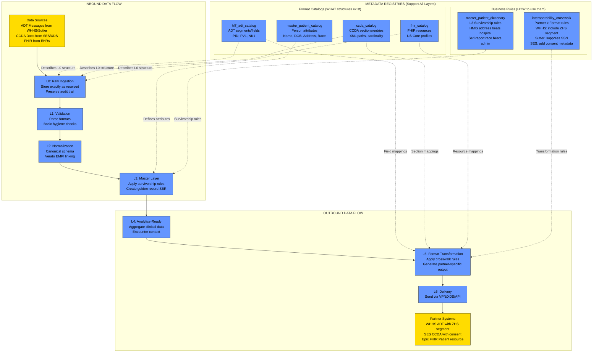
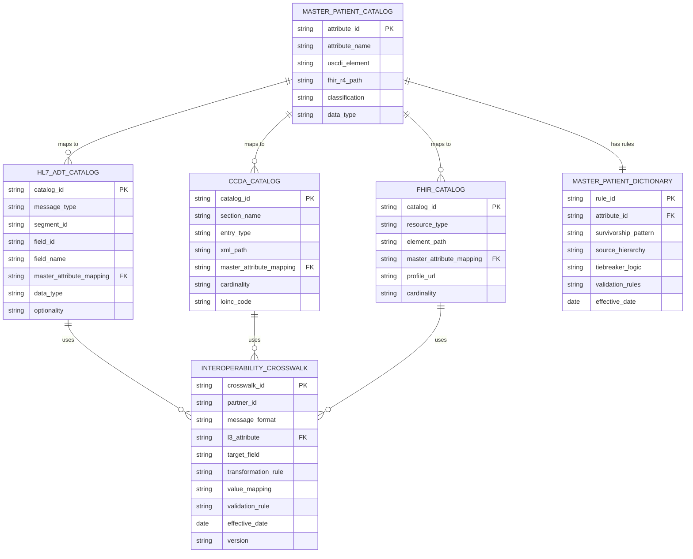
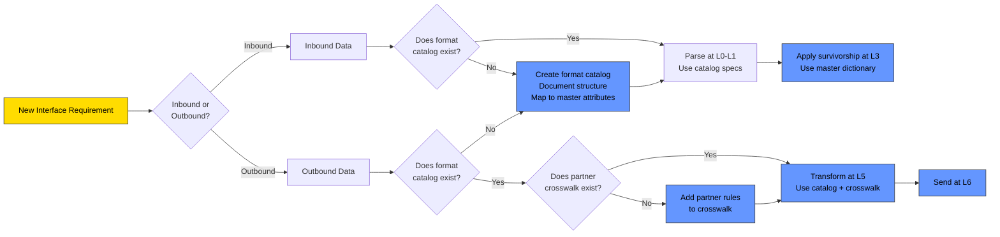
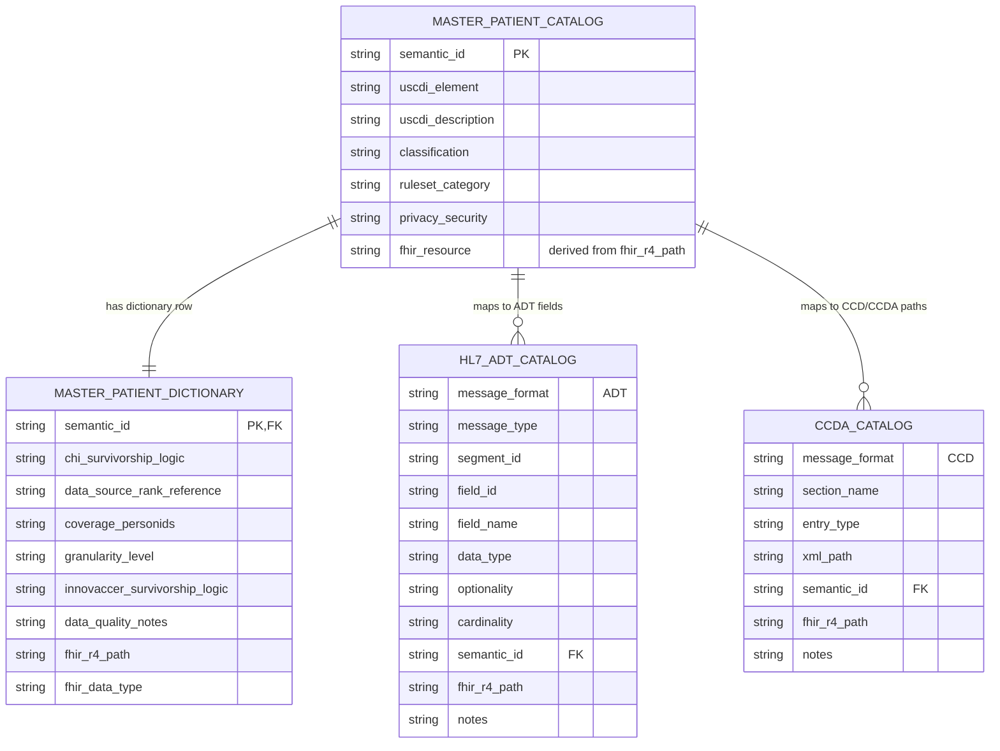

LINKS:

# **Problem Statement: Lack of HL7 ADT Message Support in the Current Metadata Architecture**

> **Status note (strategy draft / historical context):** This document mixes current-state notes, proposed future-state artifacts, and external references from earlier design sessions. For current implementation behavior and active file names, use `docs/documentation-map.md`, `README.md`, and `TECH-SPEC.md`.

The current CHI metadata catalog and data dictionary — as implemented in , and described in the PRD — successfully define a **FHIR‑aligned**, USCDI‑anchored model for master demographics and survivorship rules. These artifacts include comprehensive mappings to FHIR R4 paths, detailed source‑ranking logic, privacy classifications, and technical attributes such as coverage counts and granularity levels. [[data_catalog_pipe | Excel]](https://ajayprashar-my.sharepoint.com/personal/ajay_aprashar_com/_layouts/15/Doc.aspx?sourcedoc=%7B598AF102-C343-4655-88CA-EFBB75C8450E%7D&file=data_catalog_pipe.csv&action=default&mobileredirect=true), [[data_dictionary_pipe | Excel]](https://ajayprashar-my.sharepoint.com/personal/ajay_aprashar_com/_layouts/15/Doc.aspx?sourcedoc=%7B8B8C772E-39C0-4230-9AE3-8CE0475231F6%7D&file=data_dictionary_pipe.csv&action=default&mobileredirect=true), [[ajayprasha...epoint.com]](https://ajayprashar-my.sharepoint.com/personal/ajay_aprashar_com/Documents/Microsoft%20Copilot%20Chat%20Files/readme-prd.md)

However, **no components of the current architecture include HL7 v2 or HL7 ADT specifications**. There are:

- **No HL7 v2 segment or field mappings** analogous to the existing `fhir_r4_path` column.
- **No ADT event‑type references** (e.g., A01 admit, A03 discharge, A08 update).
- **No fields describing encounter‑level or admission‑driven data**, as the present catalog is exclusively person‑centric (name, DOB, race/ethnicity, SOGI, address, housing status, etc.). [[data_catalog_pipe | Excel]](https://ajayprashar-my.sharepoint.com/personal/ajay_aprashar_com/_layouts/15/Doc.aspx?sourcedoc=%7B598AF102-C343-4655-88CA-EFBB75C8450E%7D&file=data_catalog_pipe.csv&action=default&mobileredirect=true), [[data_dictionary_pipe | Excel]](https://ajayprashar-my.sharepoint.com/personal/ajay_aprashar_com/_layouts/15/Doc.aspx?sourcedoc=%7B8B8C772E-39C0-4230-9AE3-8CE0475231F6%7D&file=data_dictionary_pipe.csv&action=default&mobileredirect=true)
- **No ADT‑specific business rules**, despite the presence of rich survivorship rules for demographics. [[data_dictionary_pipe | Excel]](https://ajayprashar-my.sharepoint.com/personal/ajay_aprashar_com/_layouts/15/Doc.aspx?sourcedoc=%7B8B8C772E-39C0-4230-9AE3-8CE0475231F6%7D&file=data_dictionary_pipe.csv&action=default&mobileredirect=true)

This creates a **structural gap** for teams that rely on HL7 v2 message flows — particularly those addressing admission, discharge, transfer, registration updates, or patient‑identity reconciliation triggered by ADT messages. Because the metadata catalog does not express how demographic elements map into HL7 ADT message structures, the system cannot currently:

- Define how master demographic values should populate ADT segments such as PID, PD1, NK1, or PV1.
- Ensure alignment between FHIR‑based master demographics and real‑time event‑driven ADT workflows.
- Support downstream partners or systems that depend on HL7 v2 as their primary integration pathway.

As a result, **stakeholders who operate in HL7‑driven environments—such as hospital registration systems, legacy EHR interfaces, or encounter‑centric workflows—cannot use the CHI metadata catalog as a single source of truth**, despite its strength in modeling FHIR semantics and survivorship logic. [[ajayprasha...epoint.com]](https://ajayprashar-my.sharepoint.com/personal/ajay_aprashar_com/Documents/Microsoft%20Copilot%20Chat%20Files/readme-prd.md), [[m365.cloud.microsoft]](https://m365.cloud.microsoft/chat/pages/eyJ1IjoiaHR0cHM6Ly9hamF5cHJhc2hhci5zaGFyZXBvaW50LmNvbS9jb250ZW50c3RvcmFnZS94OEZOTy14dHNrdUNSWDJfZk1USExWbzQyWVF1NWZsQ2d0bGgxOFU5c21RP25hdj1jejBsTWtaamIyNTBaVzUwYzNSdmNtRm5aU1V5Um5nNFJrNVBKVEpFZUhSemEzVkRVbGd5SlRWR1prMVVTRXhXYnpReVdWRjFOV1pzUTJkMGJHZ3hPRlU1YzIxUkptUTlZaVV5TVhWRWNHTm1jR0oyYmpCeFIzQjBhMUpvVDFWT1pqWk1hVmhVUWxoQ2QxcEdkSEV3VTFWaE9FYzNWMXBYY21rbE1rUlFPVWtsTlVaRFVqVnBkbFJOU0haQlRsbHpKbVk5TURGTVJFMVBORWd5TjBsWlZUUXpRVUpETTFKRlRGWktUMGhYTTA1SVdFcFlUaVpqUFNVeVJnIn0?auth=2)

This gap limits interoperability for organizations that still rely heavily on HL7 v2 workflows (common across California HIE participants), and it prevents complete mapping coverage across the full ecosystem of clinical message exchanges.

[data_catalog_pipe.csv](https://www.notion.so/3145d66c407f8040a5b0eb5b03585e30?pvs=21)

[data_dictionary_pipe.csv](https://www.notion.so/3145d66c407f8010b006ce4619939b15?pvs=21)

---

## Strategic Analysis: HL7 Message Catalog Architecture

After reviewing the Master Patient content and the HL7 ADT problem statement, here's my strategic recommendation:

### **Recommendation: Separate Parquet Files with Shared Governance Framework**

You should **NOT** try to force HL7 message specifications into the existing `data_catalog_pipe` and `data_dictionary_pipe` files. Here's why:

### **Fundamental Architectural Mismatch**

Your current metadata architecture is **person-centric** and **FHIR-aligned**. It models:

- Master demographics attributes (name, DOB, race/ethnicity, SOGI, address)
- Survivorship rules for patient-level data
- USCDI-anchored semantic mappings
- Time-invariant or slowly-changing patient characteristics

HL7 ADT messages are **event-centric** and **workflow-aligned**. They model:

- Admission, discharge, transfer events (A01, A03, A08, etc.)
- Encounter-level context (PV1, PV2 segments)
- Point-in-time patient snapshots within a specific care episode
- Transactional updates triggered by registration or bed management systems

**Cramming both into the same file structure would create:**

- Semantic confusion (is this an attribute or an event field?)
- Governance conflicts (different stewards, different refresh cadences)
- Query inefficiency (filtering person vs. message attributes requires complex predicates)
- Schema bloat (columns irrelevant to 80% of use cases)

### **Proposed Architecture: Three-File Model**

```
ddc-master_patient_catalog.parquet          ← Person-centric attributes (current scope)
ddc-master_patient_dictionary.parquet       ← Survivorship + business rules (current scope)
hl7_message_catalog.parquet             ← NEW: HL7 v2 message specifications
hl7_message_dictionary.parquet          ← NEW: HL7 ADT business rules (optional)
```

### **What Goes in `hl7_message_catalog.parquet`**

| Column | Purpose | Example Value |
| --- | --- | --- |
| `message_type` | ADT event type | `A01`, `A03`, `A08` |
| `segment_id` | HL7 segment | `PID`, `PV1`, `NK1` |
| `field_id` | HL7 field number | `PID-3`, `PV1-2` |
| `field_name` | Human-readable name | `Patient Identifier List`, `Patient Class` |
| `data_type` | HL7 data type | `CX`, `IS`, `XPN` |
| `optionality` | Required/Optional/Conditional | `R`, `O`, `C` |
| `cardinality` | Repeating vs. single | `1`, `0..n` |
| `uscdi_mapping` | Link to USCDI if applicable | `Patient Demographics/Identifier` |
| `fhir_r4_path` | Equivalent FHIR path | `Patient.identifier`, `Encounter.class` |
| `master_attribute_mapping` | Link to person-centric catalog | `patient_identifier`, `patient_name` |
| `privacy_classification` | PII/PHI/SUD Part 2 | `PII`, `PHI` |
| `source_system_usage` | Which systems send this | `WHHS ADT`, `Sutter ADT` |

**Key Design Principle:** The `master_attribute_mapping` column creates a **controlled join** between HL7 message specifications and master patient attributes. This preserves separation while enabling cross-reference.

### **Why Not a Single Unified Catalog?**

I've seen teams try to build "one metadata catalog to rule them all." It fails because:

1. **Different consumers, different query patterns**
    - Data engineers building ADT interfaces need message-level specs (segments, fields, event types)
    - Application developers building CHR need person-level attributes (survivorship, source hierarchy)
    - Forcing both into one schema means every query drags irrelevant columns
2. **Different governance cadences**
    - HL7 v2 specs change when you onboard a new hospital (new custom Z-segments, different field usage)
    - Master patient attributes change when Housing Services redefines "Permanently Housed" logic
    - These shouldn't trigger schema evolution in the same artifact
3. **Different stewardship models**
    - Interface engineers own ADT message specs (David Klauber, Indra, you)
    - Domain SMEs own patient attributes (Kim Angeles, Housing Services for AF/AG)
    - Mixing ownership creates approval bottlenecks

### **How This Supports Your ADT Use Case**

When you need to populate an outbound ADT message with master demographics:

```sql
# Query master patient attributes for survivorship values
SELECT
    patient_id,
    patient_name_sbr,
    patient_dob_sbr,
    patient_race_sbr
FROM master_patient_catalog
WHERE patient_id = '12345'

# Query HL7 message catalog for field mappings
SELECT
    segment_id,
    field_id,
    master_attribute_mapping,
    data_type
FROM hl7_message_catalog
WHERE message_type = 'A08'
  AND segment_id = 'PID'

# Join on master_attribute_mapping to populate PID segment
```

The two catalogs **collaborate** without **coupling**.

### **Optional: Do You Need `hl7_message_dictionary.parquet`?**

Only if you have **ADT-specific business rules** that don't belong in the master patient dictionary.

Examples that WOULD justify a separate HL7 dictionary:

- "When sending A08 updates to WHHS, suppress PID-19 (SSN) per their data use agreement"
- "PV1-2 (Patient Class) maps to Innovaccer Encounter.class, but only for inpatient ADT events (A01, A02, A03)"
- "NK1 segment should only be sent for patients with ASCMI consent flag = true"

Examples that WOULD NOT justify a separate dictionary (keep in master patient dictionary):

- "Patient name survivorship ranks HMIS > EHR > self-reported"
- "Race/ethnicity follows OMB 15 minimum categories with USCDI expansion"

If your ADT business rules are mostly **"how do I map master attributes into HL7 fields?"** then you don't need a separate dictionary. Just extend `ddc-master_patient_dictionary.parquet` with an `hl7_usage` column.

### **Implementation Path**

**Phase 1: Prove the concept with WHHS ADT**

- Create `hl7_message_catalog.parquet` with just the PID segment fields you're using for WHHS
- Document the mappings: `PID-3` → `master_patient_catalog.patient_identifier`
- Build one A08 message successfully using this pattern

**Phase 2: Expand to full ADT coverage**

- Add PV1, PD1, NK1 segments
- Add A01, A03, A04, A05 event types
- Test with Sutter and St. Rose interfaces

**Phase 3: Generalize the pattern**

- Apply the same separation-of-concerns model to CCDA (clinical document vs. patient attributes)
- Apply to FHIR resources (Encounter, Condition, Observation vs. Patient demographics)

### **The Real Question You Should Be Asking**

You're asking about parquet file structure, but the deeper question is: **How do message-based formats (ADT, CCDA/CCD, FHIR) relate to DAP's L0-L6 curation layers?**

#### **Inbound Message Flow (ADT & CCDA)**

**HL7 ADT Messages (from hospitals):**

- **L0:** Raw HL7 v2.x messages ingested from VPN endpoints (WHHS, Sutter, St. Rose)
- **L1:** Parse pipe-delimited format, validate segment structure
- **L2:** Normalize to canonical schema, apply Verato identity resolution
- **L3:** Apply survivorship—does this ADT's address override our existing SBR?
- **L4-L6:** Make demographics available to analytics, CHR, and FHIR API

**CCDA Documents (from SES/XDS, Direct messaging):**

- **L0:** Raw CCDA XML documents received via XDS.b repository or Direct SMTP
- **L1:** Parse XML, validate against CCDA schema/schematron
- **L2:** Extract structured data (demographics, problems, medications, vitals), normalize codes
- **L3:** Apply survivorship—this CCDA contains patient race/ethnicity; does it win vs. existing sources?
- **L4-L6:** Aggregate clinical data for reporting and CHR display

#### **Outbound Message Flow (ADT & CCDA)**

**Generating Outbound ADT Messages (to partners):**

- **L3:** Pull master demographics SBR (name, DOB, address, housing status)
- **L4:** Enrich with encounter context (admission date, location, attending provider)
- **L5:** Transform to HL7 v2.x format via partner-specific crosswalk (WHHS wants Z-segments, Sutter suppresses SSN)
- **L6:** Send via VPN endpoints

**Generating Outbound CCDs (to SES/XDS):**

- **L3:** Pull master demographics SBR
- **L4:** Aggregate clinical data (problem list from EHRs, medications from pharmacy, vitals from encounters)
- **L5:** Transform to CCDA XML format with ASCMI consent metadata, render housing status as SDOH Observation
- **L6:** Publish to XDS.b repository or send via Direct

#### **Where Do Message Catalogs Fit?**

The catalogs (HL7 message specs, CCDA section mappings, FHIR resource profiles) are **metadata registries**, not data layers. They describe:

- **L0 structure:** "Inbound ADT messages contain PID-5 for patient name"
- **L5 transformation rules:** "Outbound CCDA renders L3 housing status as LOINC 71802-3 Observation"
- **Crosswalk mappings:** "L3 patient_race maps to PID-10 in ADT and raceCode in CCDA"

If you treat message specifications as **siblings** to your master patient catalog (not children of it), you:

- Avoid coupling person-centric survivorship to message-format details
- Support multiple message formats without schema bloat
- Enable different governance cadences (interface engineers own message specs, domain SMEs own patient attributes)

**Key Insight:** L3 master demographics is the **canonical truth**. ADT messages, CCDA documents, and FHIR resources are **renderings** of that truth in different formats for different partners. The crosswalk registry defines how to render; the message catalogs define the valid structure of each rendering.

### **Final Recommendation: Complete Metadata Architecture**

#### **Catalog Files (WHAT the formats are)**

These define the structure/schema of each message format:

```
ddc-master_patient_catalog.parquet           ← Person-centric attributes (current)
ddc-hl7_adt_catalog.parquet                  ← ADT message specs (segments, fields, data types)
ddc-ccda_catalog.parquet                     ← CCDA section/entry specs (XML paths, cardinality)
fhir_catalog.parquet                     ← FHIR resource profiles (US Core, extensions)
```

**Rationale for separation:** ADT, CCDA, and FHIR have fundamentally different structures. Querying "What fields exist in a PID segment?" is a different question than "What elements exist in a CCDA Social History section?" Format-specific catalogs keep these concerns separate.

#### **Dictionary Files (HOW to use them)**

These define business rules and transformations. Here's where it gets interesting:

**Option A: Format-Specific Dictionaries**

```
ddc-master_patient_dictionary.parquet         ← L3 survivorship rules ("HMIS address wins")
hl7_adt_dictionary.parquet               ← ADT-specific rules ("A08 triggers on address change")
ccda_dictionary.parquet                  ← CCDA-specific rules ("Include provenance in header")
fhir_dictionary.parquet                  ← FHIR-specific rules ("US Core race extension required")
```

**Option B: Unified Crosswalk Dictionary** (Recommended)

```
ddc-master_patient_dictionary.parquet         ← L3 survivorship rules (stays separate)
interoperability_crosswalk.parquet        ← ALL partner × format transformation rules
```

#### **Why Unify the Crosswalk Dictionary?**

Partner-specific rules often span multiple formats:

| **Partner** | **ADT Rule** | **CCDA Rule** | **FHIR Rule** |
| --- | --- | --- | --- |
| **WHHS** | Include custom ZHS segment for housing | Include housing as SDOH Observation | Include housing as Observation resource |
| **Sutter** | Suppress PID-19 (SSN) per DUA | Omit SSN from demographics section | Omit SSN identifier per DUA |
| **SES/XDS** | N/A (doesn't receive ADT) | Include ASCMI consent metadata | N/A |

If you split these into separate dictionaries per format, you'd duplicate the "Sutter suppresses SSN" rule three times. **A unified crosswalk dictionary consolidates partner rules** regardless of format.

#### **Recommended File Structure**

```
# Catalogs (Structure definitions - format-specific)
ddc-master_patient_catalog.parquet           ← Person-centric attributes
ddc-hl7_adt_catalog.parquet                  ← ADT segments/fields/types
ddc-ccda_catalog.parquet                     ← CCDA sections/entries/paths
fhir_catalog.parquet                     ← FHIR resources/profiles/extensions

# Dictionaries (Business rules - mostly unified)
ddc-master_patient_dictionary.parquet         ← L3 survivorship ("HMIS > EHR for address")
interoperability_crosswalk.parquet        ← Partner × format rules:
                                            - Partner ID
                                            - Message format (ADT/CCDA/FHIR)
                                            - Transformation rules (suppress, map, enrich)
                                            - Validation rules (reject if...)
                                            - Value set mappings (your codes → their codes)
```

#### **What Goes in `interoperability_crosswalk.parquet`?**

| **Column** | **Purpose** | **Example Value** |
| --- | --- | --- |
| `partner_id` | Partner identifier | `WHHS`, `SUTTER`, `SES_XDS` |
| `message_format` | Output format | `ADT`, `CCDA`, `FHIR` |
| `l3_attribute` | Source L3 field | `patient_ssn`, `housing_status` |
| `target_field` | Destination field | `PID-19`, `ZHS-1`, `socialHistory/observation` |
| `transformation_rule` | How to map | `SUPPRESS`, `MAP_VALUE_SET`, `INCLUDE_AS_IS` |
| `value_mapping` | Code translations | `{"Permanently Housed": "PH", "Unsheltered": "UNS"}` |
| `validation_rule` | Pre-send checks | `REJECT_IF_NULL`, `WARN_IF_OLDER_THAN_18_MONTHS` |
| `effective_date` | When this rule became active | `2026-03-01` |
| `version` | Rule version | `1.2` |

#### **Key Architectural Principles**

1. **Catalogs are format-specific** because message structures differ fundamentally
2. **The crosswalk dictionary is partner-centric** because partners don't care about format boundaries—they care about "what data do I get?"
3. **Master patient dictionary stays separate** because L3 survivorship is independent of interoperability concerns
4. **Link via explicit mappings:** `master_attribute_mapping` column in catalogs joins to `l3_attribute` in crosswalk

#### **When You Might Need Format-Specific Dictionaries**

If you have **format-level business rules that apply to ALL partners**, separate dictionaries make sense:

- "All CCDA documents must include documentationOf/serviceEvent for provenance"
- "All ADT A01 messages must include PV1-2 (patient class)"
- "All FHIR Patient resources must include US Core race extension"

But these are **rare**. Most rules are partner-specific, so unified crosswalk is cleaner.

#### **Presenting to Kim/Kanwar on Monday**

Frame it as: **"We're not just fixing AF/AG—we're building a metadata foundation that supports:**

1. **Master demographics at L3** (one source of truth for patient attributes)
2. **Message format catalogs** (structural specifications for ADT, CCDA, FHIR)
3. **Unified crosswalk registry** (partner-specific transformation rules across all formats)

**This architecture means:**

- Onboarding a new partner = add rows to crosswalk, not rebuild entire interfaces
- Supporting a new format = add format catalog, reuse existing L3 and crosswalk logic
- Changing survivorship logic = update L3, all outbound formats inherit the change"

That's the Master Patient Attributes leadership you're stepping into.

---

## Metadata Architecture: Visual Reference

### **Complete System Architecture**

This diagram shows how Innovaccer DAP layers interact with metadata artifacts to support interoperability:



### **Key Relationships (for ERD Development)**



### **Simplified Reference Guide**

**When building interfaces, follow this decision tree:**



### **Why Crosswalks Are Only Needed for Outbound Flows**

You may notice the decision tree treats inbound and outbound flows differently—specifically, **inbound doesn't check for a crosswalk**. This is intentional, not an oversight.

**Inbound vs. Outbound Have Different Goals:**

**Inbound (receiving data):**

- **Goal:** Normalize many different formats into ONE standard (your L3 master demographics)
- **Flow:** External format → Parse using catalog → Normalize → Apply survivorship → L3 golden record
- **Question being answered:** "What is the TRUE value for this patient's address?"

**Outbound (sending data):**

- **Goal:** Translate ONE standard (your L3) into many partner-specific formats
- **Flow:** L3 golden record → Transform using crosswalk → Partner-specific format → Send
- **Question being answered:** "How does THIS PARTNER want to receive this patient's address?"

**Why No Crosswalk on Inbound?**

When you RECEIVE an ADT from WHHS:

1. You parse it using the `hl7_adt_catalog` (which documents standard HL7 structure + any custom WHHS Z-segments)
2. You extract demographics fields
3. You apply YOUR survivorship rules from `master_patient_dictionary`: "Does WHHS address beat the existing address?"
4. Result: One golden record at L3

You don't need a WHHS-specific crosswalk because you're not trying to preserve "how WHHS wants data formatted"—you're converting it to YOUR format.

**When you SEND an ADT to WHHS:**

1. You start with L3 golden record (your format)
2. You apply the WHHS crosswalk from `interoperability_crosswalk`: "Suppress SSN", "Add custom ZHS segment for housing", "Format phone as (###) ###-####"
3. You generate HL7 ADT using `hl7_adt_catalog` + WHHS-specific rules
4. Result: WHHS gets data formatted exactly how they want it

**The Subtle Detail:**

There IS source-specific logic on inbound, but it's captured in the **format catalog**, not a crosswalk:

- The `hl7_adt_catalog` documents both standard HL7 fields (PID-5, PID-11) AND partner-specific custom segments (e.g., WHHS's ZHS segment for housing)
- Once you parse those custom fields, you normalize them to L3: WHHS housing code "PH" → L3 standard "Permanently Housed"
- This normalization logic lives in `master_patient_dictionary`, not a partner-specific crosswalk

**Bottom Line:**

- **Crosswalks are for OUTPUT customization**, not input parsing
- **Inbound:** Everyone's data gets normalized to YOUR standard (catalog + dictionary)
- **Outbound:** Your standard gets customized to EACH PARTNER'S requirements (catalog + dictionary + crosswalk)

### **Quick Reference: File Purposes**

| **File** | **Purpose** | **Owner** | **Update Frequency** |
| --- | --- | --- | --- |
| `ddc-master_patient_catalog.parquet` | Defines person-centric attributes | Data Standards Lead | Quarterly or when adding attributes |
| `ddc-hl7_adt_catalog.parquet` | Defines ADT message structure | Interface Engineers | When onboarding new ADT partner |
| `ddc-ccda_catalog.parquet` | Defines CCDA document structure | Interface Engineers | When onboarding new CCDA partner |
| `fhir_catalog.parquet` | Defines FHIR resource structure | Interface Engineers | When FHIR profiles change |
| `ddc-master_patient_dictionary.parquet` | L3 survivorship business rules | Data Governance Committee | When source hierarchy changes |
| `interoperability_crosswalk.parquet` | Partner-specific transformation rules | Interface Engineers + Legal | When DUAs change or partners onboard |

### **Next Steps for ERD Development**

1. **Expand the ERD above** with full column definitions for each table
2. **Add foreign key constraints** showing join paths
3. **Document cardinality** (1:1, 1:many, many:many)
4. **Add lookup tables** for:
    - Valid message formats (ADT, CCDA, FHIR)
    - Valid transformation rules (SUPPRESS, MAP_VALUE_SET, etc.)
    - Valid partners (WHHS, Sutter, SES, etc.)
5. **Create sample queries** showing common use cases:
    - "Give me all ADT fields that map to L3 patient_name"
    - "What crosswalk rules apply to Sutter for all formats?"
    - "Which L3 attributes don't have ADT mappings yet?"

This foundation keeps metadata **simple to manage** (separate concerns) and **quick to reference** (visual diagrams + decision trees).

---

## Current CHI Metadata Viewer ERD (POC)

The Mermaid ERD below captures the **actual Parquet structures used by the current Streamlit app**—the master patient catalog/dictionary plus the small ADT/CCD catalogs. **Where FHIR appears:** FHIR path and data type are stored as metadata in **MASTER_PATIENT_DICTIONARY** (`fhir_r4_path`, `fhir_data_type`) and in **HL7_ADT_CATALOG** / **CCDA_CATALOG** (per-format `fhir_r4_path`). This POC does **not** store FHIR resource instance data (e.g. Patient/Encounter JSON); that would live in FHIR servers, APIs, or other data stores, not in these Parquet files.



### Mermaid ERD syntax notes (avoid "Syntax error in graph")

When editing this ERD (here or in the Streamlit app’s `_ERD_MERMAID`), follow these rules so Mermaid 9.x can parse it:

1. **Attribute keys**  
   Only `PK`, `FK`, and `UK` are valid. For an attribute that is both primary and foreign key, use **comma-separated** keys: `PK, FK`.  
   - **Wrong:** `semantic_id PK_FK` → causes "Syntax error in graph".  
   - **Right:** `semantic_id PK, FK`.

2. **Relationship cardinality**  
   Use **single** braces in the cardinality (e.g. one-to-many: `||--o{`).  
   - **Wrong:** `||--o{{` (double brace) → causes syntax error.  
   - **Right:** `||--o{`.

Keep the diagram in `app.py` and in this file in sync when changing the ERD. If the in‑app ERD breaks again, the safest fix is to copy this entire `erDiagram` block into `_ERD_MERMAID` in `app.py`.

---

## FUTURE / POST POC — Extended ERD (coding system tables)

The Streamlit app includes a second ERD under **Documentation → FUTURE / POST POC** that shows the extended model with value-set/code-system tables and crosswalks that were strategically left out of the current POC:

- **VALUE_SET_DEFINITION** — Value set metadata (name, code system, version)
- **VALUE_SET_MEMBER** — Codes within a value set (code, display, definition)
- **SEMANTIC_ID_VALUE_SET** — Bridge linking catalog elements to value sets (binding strength, notes)
- **FHIR_CATALOG** — Format catalog for FHIR (resource type, element path, profile)
- **INTEROPERABILITY_CROSSWALK** — Partner-specific transformation rules (target field, value mapping)

See the "Value set / code system support (future extension)" and "Key Relationships" sections below for details.

---

## Table definitions and future extensions

### Current tables (POC)

- **MASTER_PATIENT_CATALOG**  
  Catalog view of CHI data elements; one row per `semantic_id`. Contains element name, USCDI reference, classification, ruleset category, privacy/security flags, and a derived FHIR resource name.

- **MASTER_PATIENT_DICTIONARY**  
  Dictionary view of each element; one row per `semantic_id`. Contains survivorship logic, data source rank reference, coverage metrics, granularity level, Innovaccer-specific logic, data‑quality notes, and the canonical FHIR R4 path and data type.

- **HL7_ADT_CATALOG**  
  Message-format catalog for HL7 ADT. Each row describes where a `semantic_id` appears in ADT messages (message type, segment/field), plus HL7 data type, optionality, cardinality, and an optional FHIR path and notes.

- **CCDA_CATALOG**  
  Message-format catalog for CCD/CCDA. Each row describes where a `semantic_id` appears in CCD/CCDA XML (section, entry type, XML path), plus an optional FHIR path and notes.

These four tables support the current POC goal: a single CHI catalog/dictionary that maps to FHIR R4, HL7 ADT, and CCD/CCDA locations.

### Versioning / effective dating (future extension)

To support change over time (schema changes, rule changes, mapping changes), introduce **effective dating** columns on the dictionary and mapping tables; for example:

- Add to `MASTER_PATIENT_DICTIONARY`, `HL7_ADT_CATALOG`, and `CCDA_CATALOG`:
  - `effective_start_date` (DATE or TIMESTAMP)
  - `effective_end_date` (DATE or TIMESTAMP, nullable)
  - Optional `version_label` (e.g., `"v1.0"`, `"2026-CHI-refresh"`)

Semantics:

- At query time, filter on a **point-in-time**:  
  `WHERE effective_start_date <= :as_of AND (effective_end_date IS NULL OR effective_end_date > :as_of)`.
- This allows multiple historical rows per `semantic_id` and message location while keeping the catalog view (`MASTER_PATIENT_CATALOG`) stable.

### Value set / code system support (future extension)

Many data elements are coded (LOINC, SNOMED CT, ICD‑10, local codes). Rather than embedding codes directly into the four core tables, model them separately:

- **VALUE_SET_DEFINITION**  
  - `value_set_id` (PK)  
  - `name`  
  - `description`  
  - `code_system` (e.g., `LOINC`, `SNOMED`, `ICD10CM`)  
  - `version` (e.g., `2.74`, `2026-03`)  

- **VALUE_SET_MEMBER**  
  - `value_set_id` (FK → VALUE_SET_DEFINITION)  
  - `code`  
  - `display`  
  - Optional `definition`, `inactive_flag`.

- **SEMANTIC_ID_VALUE_SET** (bridge)  
  - `semantic_id` (FK → MASTER_PATIENT_CATALOG/DICTIONARY)  
  - `value_set_id` (FK → VALUE_SET_DEFINITION)  
  - Optional `binding_strength` (`required`, `extensible`, `preferred`) and `binding_notes`.

This keeps the core catalog/dictionary tables focused on **where** data lives and **how** it behaves, while the value‑set tables capture **which codes are allowed or expected** for a given element.