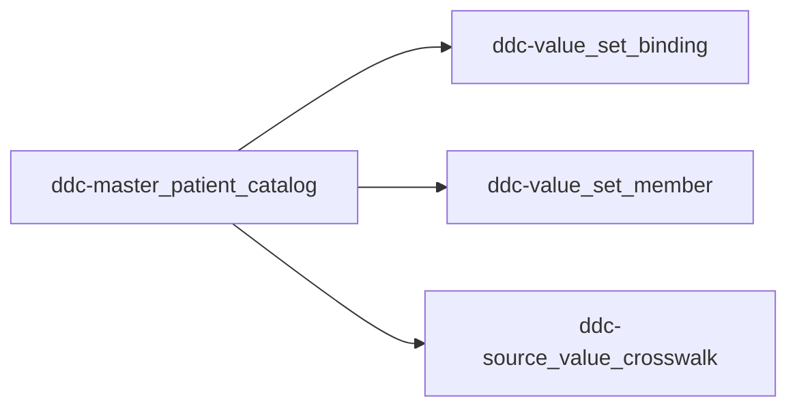

# Crosswalk and Value Set Model

How CHI documents **which standards apply**, **which codes are governed**, and **how source values map** — without duplicating full terminology catalogs (DAP remains system of record per `TECH-SPEC.md` §1.7).

**Related:** `docs/shie-standards-reference.md`, `docs/operational-runbook.md`, `docs/demographics-pilot-plan.md`

---

## Three companion tables (not one mega-table)

| Parquet | Sheet | Grain | Purpose |
|---------|-------|-------|---------|
| `ddc-value_set_binding.parquet` | `Value_Set_Bindings` | 1 row per (`semantic_id`, `binding_role`) | Which value set / code system applies |
| `ddc-value_set_member.parquet` | `Value_Set_Members` | 1 row per (`semantic_id`, `code`) | CHI-governed codes (subset, not full CDCREC) |
| `ddc-source_value_crosswalk.parquet` | `Source_Value_Crosswalk` | 1 row per source value → target | **Crosswalk:** CMT (etc.) → standard code |

All join to **`semantic_id`** on the master catalog.



---

## What this repo does **not** host

| Do not duplicate locally | Use instead |
|--------------------------|-------------|
| Full CDCREC / SNOMED / LOINC / ICD-10 | HL7 terminology URLs + **DAP** at runtime |
| Every BCP 47 language tag | Binding + pilot **examples**; expand as needed |
| ICD-10 / ICD-9 (not in demographics pilot) | Add when curating clinical `semantic_id`s |

**Demographics pilot:** no ICD download required. Seed from `docs/shie-standards-reference.md` via `scripts/seed_value_sets_pilot.py`.

---

## Column reference

### Value set binding

| Column | Example (`Patient.race`) |
|--------|--------------------------|
| `semantic_id` | `Patient.race` |
| `binding_role` | `primary` |
| `value_set_url` | `http://terminology.hl7.org/ValueSet/v3-Race` |
| `code_system_oid` | `urn:oid:2.16.840.1.113883.6.238` |
| `binding_strength` | `required` |
| `fhir_element` | `Patient.extension(us-core-race).ombCategory` |

### Value set member

| Column | Example |
|--------|---------|
| `code` | `2054-5` |
| `display` | Black or African American |
| `member_type` | `omb_rollup` / `nullflavor` / `language_tag` / `administrative` |
| `active` | `true` |

### Source value crosswalk

| Column | Example |
|--------|---------|
| `source_id` | `county_master` (survivorship) or `cmt` (ADT field) |
| `source_field` | `Race`, `Ethnicity`, `Language`, `SexID` or `PID-10`, etc. |
| `source_code` | Local source string (e.g. `Japanese`, `Mexican`, `eng`) |
| `target_code` | `2054-5` |
| `mapping_type` | `exact` / `rollup` / `exclude` |
| `approval_status` | `draft` until steward validates |

---

## Publish ritual

```powershell
# Governed CDCREC codes from HL7 (optional; preserves nullflavor rows):
python scripts/build_value_set_members.py --write-cache

# County survivorship crosswalk (Table 4/5/2 → standard codes):
python scripts/seed_county_master_crosswalk.py

# Pilot value set bindings + member seed (maintainers — does not overwrite crosswalk):
python scripts/seed_value_sets_pilot.py

# Regenerate steward workbook after parquet rebuilds:
python scripts/generate_steward_workbook.py

# Or edit Value_Set_* / Source_Value_Crosswalk sheets in Excel, then:
python scripts/import_steward_workbook_to_parquet.py
```

Refresh Power BI → **Standards & Contexts** shows **Governed value set** and **Source crosswalk** tables.

---

## When you **will** need external datasets

| Domain | Typical source | When |
|--------|----------------|------|
| Race / ethnicity | [HL7 Race/Ethnicity ValueSet](https://terminology.hl7.org/) | Expanding beyond OMB pilot subset |
| Language | BCP 47 / IANA | Large language crosswalk from partner intake |
| Gender identity | US Core + LOINC 76691-5 answer codes | After partner code inventory |
| **ICD-10-CM / ICD-9** | CMS / NLM / **DAP** | Clinical concepts (problems, diagnoses) — **not demographics pilot** |
| SNOMED / LOINC clinical | **DAP** | Clinical attributes |

For production clinical expansion, reference DAP by ID in `authority_reference` or a future `dap_value_set_id` column — do not import full ICD tables into this repo unless CHI explicitly chooses a local overlay.

---

## County master crosswalk (`county_master`)

`scripts/seed_county_master_crosswalk.py` seeds **local source strings** from the SHIE master-demographics survivorship workbook (Table 4 language, Table 5 race/ethnicity, Table 2 SexID) into `ddc-source_value_crosswalk.parquet`:

| `source_field` | `semantic_id` | Maps to |
|----------------|---------------|---------|
| `Race` | `Patient.race` | CDCREC OMB rollup codes |
| `Ethnicity` | `Patient.ethnicity` | CDCREC OMB rollup codes |
| `Language` | `Patient.language` | BCP 47 tags |
| `SexID` | `Patient.birth_sex` | US Core birth sex (`M`/`F`) — **not** `Patient.gender_id` |

Rows ship with `approval_status` = `draft` until the steward validates in Excel and publishes.

**Still separate:** CMT ADT `PID-10` / `PID-22` CE codes (often low fill) — add under `source_id` = `cmt` when a validated ADT code list is available.

Set `approval_status` to `Approved` when mappings are steward-signed.
