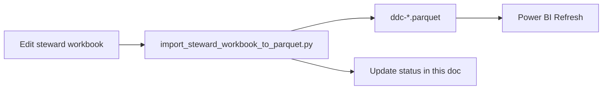

# Demographics Pilot Plan

Operational plan for the **5-attribute demographics pilot** and the path to additional measures. This is the living status and next-steps doc for stewards and project leads.

**Product vision (north star):** `docs/product-vision.md` — governed catalog + dictionary, standards-based curation, ADT/CDA/FHIR contexts in Power BI.

**Related docs**

| Doc | Role |
|-----|------|
| `docs/operational-runbook.md` | Level A production: roles, git publish, checklists (no SharePoint) |
| `docs/excel-workbook-guide.md` | How to edit sheets and run import/export |
| `docs/power-bi-concept-profile-setup.md` | How to open and refresh the read-only viewer |
| `readme-prd.md` | Executive summary for stakeholders |
| `docs/shie-standards-reference.md` | SHIE standards (CDCREC, BCP 47, NullFlavor) → pilot attributes |
| `TECH-SPEC.md` | Column schemas and architecture reference |

---

## Primary goal

Create a governed **Data Catalog** and **Data Dictionary** for five demographics attributes, then repeat the same pattern for other measures (clinical, SDOH, etc.).

**Pilot attributes** (join key: `semantic_id`):

| `semantic_id` | USCDI element |
|---------------|---------------|
| `Patient.race` | Race |
| `Patient.ethnicity` | Ethnicity |
| `Patient.language` | Preferred Language |
| `Patient.gender_id` | Gender Identity |
| `Patient.birth_sex` | Sex |

---

## Where we are (honest state)

*Last verified against parquet in repo — update this section after each import.*

### Infrastructure: largely done

| Layer | Status |
|-------|--------|
| Data model (catalog + dictionary + `semantic_id`) | Done — see `TECH-SPEC.md` |
| Steward workbook (`workbooks/chi-steward-workbook.xlsx`) | Done |
| Parquet artifacts (`ddc-master_patient_*.parquet`, `ddc-data_source_availability.parquet`) | Done |
| Import / export scripts | Done |
| Power BI viewer (`workbooks/pbip/chi-data-dictionary-catalog.pbip`) | Done |

### Governance content: Phase 1 in progress

| Metric | Current |
|--------|---------|
| Pilot rows with `approval_status` = Approved | **5 / 5** |
| Pilot rows with `data_steward` assigned | **5 / 5** (`Ajay Prashar`) |
| Publisher (Level A) | **Ajay Prashar** — see `docs/operational-runbook.md` |
| Pilot rows with FHIR path in Dictionary | **5 / 5** |
| Pilot rows with survivorship logic in Dictionary | **5 / 5** (SHIE county summaries seeded) |
| Source links with non-`unknown` availability | **5 / 5** (`cmt`, `partial`) |
| County master crosswalk (`county_master`) | **186 rows Approved** — full Table 4/5/2 SQL via `data/county_survivorship_mappings.py` |
| `Value_Set_Members` (race/ethnicity HL7 expand) | **936 rows** — `build_value_set_members.py` |

Remaining Phase 1 work: **Power BI Refresh** and Concept Profile sign-off per attribute (manual in Desktop).

---

## Catalog vs dictionary (what to fill in)

| Steward need | **Catalog** (`chi_catalog`) | **Dictionary** (`chi_dictionary`) | **Source_Availability** |
|--------------|----------------------------|-----------------------------------|---------------------------|
| Semantic ID | `semantic_id` | `semantic_id` | `semantic_id` |
| Business definition | `uscdi_element`, `uscdi_description` | — | — |
| Classification / USCDI context | `classification`, `ruleset_category` | — | — |
| Data owner | `data_steward`, `steward_contact` | — | — |
| Approval | `approval_status` | — | — |
| Consent / HIPAA tags | `hipaa_category`, `consent_category`, etc. | — | — |
| HL7 / FHIR | — | `fhir_r4_path`, `fhir_data_type` | ADT/CCDA sheets (optional) |
| Survivorship | — | `chi_survivorship_logic` | — |
| Quality notes | — | `data_quality_notes` | — |
| Which sources have the element | — | `data_source_rank_reference` | `source_id`, `availability` |
| Used for (equity, consent, DxF) | *Gap — use `Steward_Queue` notes for now* | — | — |

You do **not** need a separate `SHIE_Data_Catalog_Demographics.xlsx`. The steward workbook **is** the catalog + dictionary; Power BI is the browse/review surface.

---

## SHIE survivorship mapping

Maps **SHIE county master-demographics logic** (survivorship spreadsheet, CMT SQL, Care Insights groupings) into the steward workbook. **Do not paste full SQL** into Excel — summarize rules in `chi_survivorship_logic`; implementation SQL stays in SHIE systems.

### Why these five attributes

| Driver | Relevance |
|--------|-----------|
| Health equity reporting | Health Equity Dashboard |
| Consent | ASCMI framework |
| Crosswalks | Documented race/ethnicity/language mappings already exist |
| Scope | Small enough to finish manually in ~2 weeks |
| Process | Validates catalog + dictionary before scaling |

### SHIE spreadsheet row → `semantic_id`

| SHIE master-demographics attribute | Pilot `semantic_id` | Notes |
|-----------------------------------|---------------------|-------|
| Race – Rollup / Detail | `Patient.race` | CDC OMB; detail trumps rollup |
| Ethnicity – Rollup / Detail | `Patient.ethnicity` | CDC E1/E2; detail trumps rollup |
| Language – Rollup / Detail | `Patient.language` | ISO 639 detail → macrolanguage rollup |
| Gender Identity (USCDI) | `Patient.gender_id` | Self-report; LOINC 76691-5 — **not** CMT `SexID` rollup |
| Birth sex / Sex (`SexID`) | `Patient.birth_sex` | CMT “Gender – Rollup/Detail” SQL applies here, not `gender_id` |

### Where each kind of SHIE content goes

| SHIE content | Workbook sheet | Column(s) |
|--------------|----------------|-----------|
| Data owner, approval | **Catalog** | `data_steward`, `steward_contact`, `approval_status` |
| ASCMI / HIPAA context | **Catalog** | `consent_category`, `hipaa_category` |
| County survivorship rules (summary) | **Dictionary** | `chi_survivorship_logic` |
| Code sets, terminology OIDs, NullFlavor | **Dictionary** | `data_quality_notes` (see `docs/shie-standards-reference.md`) |
| Source ranking narrative | **Dictionary** | `data_source_rank_reference` |
| Per-source coverage today | **Source_Availability** | `source_id`, `availability`, `completeness_pct`, `notes` |
| Used for (equity, consent, DxF) | **Steward_Queue** | `steward_action_notes`, `next_action` |
| Full rule expressions (later) | **Business_Rules** | optional — defer until Phase 1 complete |

### Cross-cutting SHIE rules (all five)

Use these themes in `chi_survivorship_logic` or `data_source_rank_reference` where they apply:

- **Record scope:** CMT expanded population (`AccountID` 1000); backend EMPI not restricted; sharing is a separate decision.
- **Data enterprises:** Non-operational enterprises with patient records; exclusions per county SQL (e.g. `0`, `1000`, `3000`, `3001`, `1400`, `1600`, `2603` — confirm current list with Andrea/county logic).
- **Source reliability tiers (1–3):** Low = distress/infrequent/poor-known (e.g. ESO, ZOLL); high = trusted clinical/registration; weigh by tier then recency/completeness.
- **Unknown / not informative:** Treat `Unknown`, `DTS`, `Declined`, `Other` (where noted) as null for aggregates — same as missing.
- **Detail trumps rollup:** Prefer granular value when mapping to reporting rollup (e.g. Japanese → Asian, Mexican → Hispanic or Latino).
- **INV / curation alert:** Unmapped new source values trigger steward review (document in `data_quality_notes`).

### Example steward text (copy and adapt)

Replace bracketed placeholders. Keep each `chi_survivorship_logic` cell to **~3–8 lines** for Power BI readability.

#### `Patient.race`

**Catalog:** `data_steward` = *[owner]* · `approval_status` = `Approved` · `consent_category` = `ASCMI` *(or team label)*

**Dictionary — `chi_survivorship_logic`:**

```text
County: CDC PHIN Race/Ethnicity v1.3 OMB rollup (R1–R5, R9, Multi-Racial). Detail trumps rollup (e.g. Japanese > Asian).
Exclude Unknown, DTS, Other Race from aggregates. Self-report first; else reliability-tiered (FQHC/community > BH > hospital > payer).
Multi-racial when consistent across sources. Alert on unmapped values for curation.
```

**Dictionary — `data_quality_notes`:** CDCREC OID, HL7 Race Value Set, example ombCategory codes, NullFlavor, OMB/Table 5 rollup — see `docs/shie-standards-reference.md` and seeded text in `seed_demographics_pilot.py`.

**Dictionary — `data_source_rank_reference`:** `CMT expanded pop. Reliability tiers 1–3. Example ranking: Highland #1, Alliance #7, Housing #20 (Mark Table 2).`

**Source_Availability (`cmt`):** `availability` = `partial` · `notes` = `CMT roster human fields; anonymous list excluded per Verato`

**Steward_Queue — `steward_action_notes`:** `Health equity dashboard; ASCMI consent; crosswalk validation`

---

#### `Patient.ethnicity`

**Dictionary — `chi_survivorship_logic`:**

```text
County: CDC OMB ethnicity rollup (Hispanic or Latino / Not Hispanic or Latino). Detail trumps rollup (e.g. Mexican, Cuban > Hispanic or Latino).
Exclude Unknown, declined, and patient-refused from aggregates. Self-report first; reliability-tiered fallback.
```

**Dictionary — `data_quality_notes`:** `7+ ethnicity values; Housing high coverage, lower granularity; Table 5 – Initial Ethnicity Groupings.`

**Steward_Queue — `steward_action_notes`:** `Health equity dashboard; ASCMI consent`

---

#### `Patient.language`

**Dictionary — `chi_survivorship_logic`:**

```text
County: ISO 639 detail preferred over macrolanguage rollup (e.g. Japanese > Asian group). Preferred/self-reported language wins when timestamped.
Exclude undetermined and declined-to-specify from aggregates. Interpreter/clinical context may override when documented.
```

**Dictionary — `data_quality_notes`:** `112+ language values; critical for Mam-speaking outreach; HL7 Languages value set; Table 4 – Initial Language Groupings.`

**Dictionary — `data_source_rank_reference`:** `Highland #1 (broad language capture); St Rose #17 per Mark Table 2.`

**Steward_Queue — `steward_action_notes`:** `Health equity dashboard; outreach language targeting`

---

#### `Patient.gender_id`

**Dictionary — `chi_survivorship_logic`:**

```text
County: Gender identity is self-reported; patient preference always wins. Most recent valid value with timestamp.
US Core v5+ Observation (LOINC 76691-5). Rollup for visuals (Female / Male / Other) may collapse transition labels per equity policy — detail retained for drill-through.
Do not apply CMT SexID survivorship here; that governs birth sex / administrative sex.
```

**Dictionary — `data_quality_notes`:** `Distinct from Patient.birth_sex (SexID). Table 2 – Gender Groupings applies to SBR rollup, not identity Observation.`

**Steward_Queue — `steward_action_notes`:** `ASCMI consent; equity reporting`

---

#### `Patient.birth_sex`

**Dictionary — `chi_survivorship_logic`:**

```text
County: CMT SexID logic — ignore Unknown (U) as null at master level. Most recently modified among valid values.
Reliability-weighted when sources conflict; used in UMPI matching. Clinical/legal sources may trump self-report for birth sex per policy.
For SBR rollup: map Male to Female → Female, Female to Male → Male per county grouping rules (Table 2).
```

**Dictionary — `data_source_rank_reference`:** `Verato UMPI match field; hospital registration prioritized over low-reliability EMS sources.`

**Steward_Queue — `steward_action_notes`:** `UMPI matching; clinical use; not interchangeable with gender identity`

---

### Workbook session order (one attribute)

1. **Concept_Explorer** or **Steward_Queue** → pick `semantic_id`.
2. **Catalog** → steward, approval, consent/HIPAA tags.
3. **Dictionary** → paste/adapt survivorship summary above; tune `data_quality_notes` and source rank.
4. **Source_Availability** → set `cmt` (and others later) to `partial` or `full`, not `unknown`.
5. **Steward_Queue** → `steward_action_notes` (used for), `curation_status` when done.
6. Save → `python scripts/import_steward_workbook_to_parquet.py` → Power BI **Refresh**.

**Re-seed from plan text (parquet + workbook):**

```powershell
python scripts/seed_demographics_pilot.py
python scripts/build_value_set_members.py --write-cache   # optional HL7 expand
python scripts/seed_county_master_crosswalk.py
python scripts/generate_steward_workbook.py
```

**Suggested pilot order:** `Patient.race` (template) → ethnicity → language → gender_id → birth_sex.

### What appears in Power BI after publish

| You filled | Concept Profile shows | Standards & Contexts shows |
|------------|----------------------|----------------------------|
| Catalog `data_steward`, `approval_status` | Profile cards | (via slicer filter) |
| Catalog consent/HIPAA | Business & USCDI governance table | — |
| Dictionary FHIR + terminology | Implementation table (`fhir_profile`, `data_quality_notes`) | FHIR + terminology table |
| Dictionary survivorship | `chi_survivorship_logic` | Same table |
| ADT_Mappings rows | — | HL7 ADT table (CE pairs merged: `PID-10`, `PID-22`, `PID-16` show `.1^ .2` encoding) |
| CCDA_Mappings rows | — | C-CDA XML path table |
| Value_Set_Members (Excel: full HL7 expansion) | — | Governed value set codes — **PBIP defaults to OMB rollup + pilot codes** (~21 rows; detailed race codes in Excel) |
| Source_Value_Crosswalk | — | Source → standard code map (e.g. `cmt`) |
| Source_Availability | Source availability table | — |

See **`docs/product-vision.md`** for the layered standards model.

---

## Phased plan

### Phase 1 — Finish the five (current priority)

**Outcome:** Five rows a stakeholder can open in Power BI and treat as governed.

For each pilot `semantic_id`:

1. Open `workbooks/chi-steward-workbook.xlsx`.
2. Use **Steward_Queue** or **Concept_Explorer** (set B3 to the `semantic_id`).
3. On **Catalog**: set `data_steward`, then `approval_status` = `Approved` when ready (values in **Lookup_Lists**).
4. On **Dictionary**: review `fhir_r4_path` and `chi_survivorship_logic` — use **[SHIE survivorship mapping](#shie-survivorship-mapping)** for county rule summaries (mostly seeded; refine, don’t paste SQL).
5. On **Source_Availability**: set honest `availability` (`full` / `partial` / `none`) per `source_id` you can defend today.
6. Save workbook → import:

   ```powershell
   python scripts/import_steward_workbook_to_parquet.py
   ```

7. Open PBIP in Power BI Desktop → **Refresh** → verify **Concept Profile** for that `semantic_id`.

**Phase 1 done when:** Governance Overview shows **5** Demographics Pilot and **5** Approved (or each exception is documented in **Steward_Queue**).

---

### Phase 2 — Close the equity / consent tagging gap

Add stewardship context the legacy demographics sheet called **Used For** (equity reporting, consent, DxF):

- **POC:** use **Steward_Queue** `next_action` / notes columns.
- **Later (optional):** add a `used_for` column to Catalog if the team wants it in Power BI filters.

---

### Phase 3 — Add real sources (after Phase 1)

Follow `docs/adding-data-sources.md`:

1. Register sources on **Source_Registry**.
2. Add rows on **Source_Availability** (one row per `semantic_id` + `source_id`).
3. Use **chi-partner-intake-workbook.xlsx** only when a partner is actively onboarding.

Do not chase full 28-source coverage until the five are approved and one additional source is linked as a pattern.

---

### Phase 4 — Expand to other measures

Same workflow as Phase 1:

1. Pick the next concepts (e.g. ICD-10, problems, procedures) — many may already exist as rows in Catalog (~46 concepts today).
2. Filter in Excel or Power BI **Governance Overview**.
3. Curate Catalog + Dictionary + Source_Availability per row.
4. Set `approval_status` when each is ready.

No new platform — more governed rows through the same catalog/dictionary split.

---

## Per-attribute checklist

Copy this block when curating; check off in **Steward_Queue** or here as you go.

### `Patient.race`

- [x] `data_steward` set on Catalog
- [x] `approval_status` = Approved (or documented exception)
- [x] FHIR path reviewed on Dictionary
- [x] Survivorship logic reviewed on Dictionary
- [x] Source_Availability: at least one source with non-`unknown` availability
- [ ] Power BI Concept Profile verified after import

### `Patient.ethnicity`

- [x] `data_steward` set on Catalog
- [x] `approval_status` = Approved (or documented exception)
- [x] FHIR path reviewed on Dictionary
- [x] Survivorship logic reviewed on Dictionary
- [x] Source_Availability: at least one source with non-`unknown` availability
- [ ] Power BI Concept Profile verified after import

### `Patient.language`

- [x] `data_steward` set on Catalog
- [x] `approval_status` = Approved (or documented exception)
- [x] FHIR path reviewed on Dictionary
- [x] Survivorship logic reviewed on Dictionary
- [x] Source_Availability: at least one source with non-`unknown` availability
- [ ] Power BI Concept Profile verified after import

### `Patient.gender_id`

- [x] `data_steward` set on Catalog
- [x] `approval_status` = Approved (or documented exception)
- [x] FHIR path reviewed on Dictionary
- [x] Survivorship logic reviewed on Dictionary
- [x] Source_Availability: at least one source with non-`unknown` availability
- [ ] Power BI Concept Profile verified after import

### `Patient.birth_sex`

- [x] `data_steward` set on Catalog
- [x] `approval_status` = Approved (or documented exception)
- [x] FHIR path reviewed on Dictionary
- [x] Survivorship logic reviewed on Dictionary
- [x] Source_Availability: at least one source with non-`unknown` availability
- [ ] Power BI Concept Profile verified after import

---

## Definition of done

### Data Catalog (5 demographics)

Each pilot `semantic_id` has USCDI identity and description, classification, assigned steward, and approval status (or a documented reason it is not approved).

### Data Dictionary (5 demographics)

Each has a reviewed FHIR path, survivorship logic, and data quality notes where needed.

### Source linking

Each has at least one `source_id` with availability you can defend (not left as `unknown` without reason).

### Review

Power BI **Concept Profile** shows catalog + dictionary + sources for any of the five without hunting across Excel sheets.

---

## What not to do (keeps the pilot moving)

| Avoid | Do instead |
|-------|------------|
| More PBIP layout or generator tweaks | Curate the five rows in Excel |
| SharePoint until concurrent edit is needed | Local folder (+ git) for POC |
| Perfect multi-source matrix on day one | `cmt` + honest availability per concept |
| Rebuilding a separate demographics-only Excel file | Steward workbook + Power BI |
| Full FHIR inventory curation | Pilot five only |
| Heavy automation beyond import/export | `import_steward_workbook_to_parquet.py` |

---

## Operating rhythm

Full workflow rationale (Excel → parquet → Power BI layers and publish ritual): **`docs/excel-workbook-guide.md`** → *Operating model*.



After each working session:

1. Import workbook → parquet.
2. Refresh Power BI and spot-check one `semantic_id`.
3. Update the **Where we are** table at the top of this doc if counts changed.
