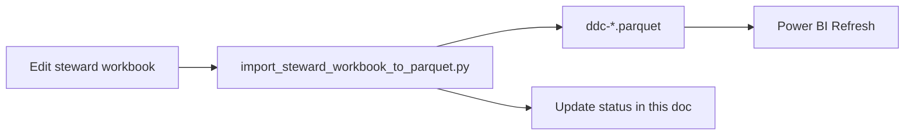

# Demographics Pilot Plan

Operational plan for the **5-attribute demographics pilot** and the path to additional measures. This is the living status and next-steps doc for stewards and project leads.

**Related docs**

| Doc | Role |
|-----|------|
| `docs/excel-workbook-guide.md` | How to edit sheets and run import/export |
| `docs/power-bi-concept-profile-setup.md` | How to open and refresh the read-only viewer |
| `readme-prd.md` | Executive summary for stakeholders |
| `TECH-SPEC.md` | Column schemas and architecture reference |

---

## Primary goal

Create a governed **Data Catalog** and **Data Dictionary** for five demographics attributes, then repeat the same pattern for other measures (clinical, SDOH, etc.).

**Pilot attributes** (join key: `semantic_id`):

| `semantic_id` | USCDI element |
|---------------|---------------|
| `Patient.race` | Race |
| `Patient.ethnicity` | Ethnicity |
| `Patient.language` | Preferred Language |
| `Patient.gender_id` | Gender Identity |
| `Patient.birth_sex` | Sex |

---

## Where we are (honest state)

*Last verified against parquet in repo — update this section after each import.*

### Infrastructure: largely done

| Layer | Status |
|-------|--------|
| Data model (catalog + dictionary + `semantic_id`) | Done — see `TECH-SPEC.md` |
| Steward workbook (`workbooks/chi-steward-workbook.xlsx`) | Done |
| Parquet artifacts (`ddc-master_patient_*.parquet`, `ddc-data_source_availability.parquet`) | Done |
| Import / export scripts | Done |
| Power BI viewer (`workbooks/pbip/chi-data-dictionary-catalog.pbip`) | Done |

### Governance content: not done yet

| Metric | Current |
|--------|---------|
| Pilot rows with `approval_status` = Approved | **0 / 5** |
| Pilot rows with `data_steward` assigned | **0 / 5** |
| Pilot rows with FHIR path in Dictionary | **5 / 5** |
| Pilot rows with survivorship logic in Dictionary | **5 / 5** |
| Source links with non-`unknown` availability | **0 / 5** (all `cmt`, `unknown`) |

The repo proves the **model and workflow**. The missing work is **stewardship of content** in Excel — not more tooling.

---

## Catalog vs dictionary (what to fill in)

| Steward need | **Catalog** (`chi_catalog`) | **Dictionary** (`chi_dictionary`) | **Source_Availability** |
|--------------|----------------------------|-----------------------------------|---------------------------|
| Semantic ID | `semantic_id` | `semantic_id` | `semantic_id` |
| Business definition | `uscdi_element`, `uscdi_description` | — | — |
| Classification / USCDI context | `classification`, `ruleset_category` | — | — |
| Data owner | `data_steward`, `steward_contact` | — | — |
| Approval | `approval_status` | — | — |
| Consent / HIPAA tags | `hipaa_category`, `consent_category`, etc. | — | — |
| HL7 / FHIR | — | `fhir_r4_path`, `fhir_data_type` | ADT/CCDA sheets (optional) |
| Survivorship | — | `chi_survivorship_logic` | — |
| Quality notes | — | `data_quality_notes` | — |
| Which sources have the element | — | `data_source_rank_reference` | `source_id`, `availability` |
| Used for (equity, consent, DxF) | *Gap — use `Steward_Queue` notes for now* | — | — |

You do **not** need a separate `SHIE_Data_Catalog_Demographics.xlsx`. The steward workbook **is** the catalog + dictionary; Power BI is the browse/review surface.

---

## Phased plan

### Phase 1 — Finish the five (current priority)

**Outcome:** Five rows a stakeholder can open in Power BI and treat as governed.

For each pilot `semantic_id`:

1. Open `workbooks/chi-steward-workbook.xlsx`.
2. Use **Steward_Queue** or **Concept_Explorer** (set B3 to the `semantic_id`).
3. On **Catalog**: set `data_steward`, then `approval_status` = `Approved` when ready (values in **Lookup_Lists**).
4. On **Dictionary**: review `fhir_r4_path` and `chi_survivorship_logic` (mostly populated — confirm, don’t rewrite blindly).
5. On **Source_Availability**: set honest `availability` (`full` / `partial` / `none`) per `source_id` you can defend today.
6. Save workbook → import:

   ```powershell
   python scripts/import_steward_workbook_to_parquet.py
   ```

7. Open PBIP in Power BI Desktop → **Refresh** → verify **Concept Profile** for that `semantic_id`.

**Phase 1 done when:** Governance Overview shows **5** Demographics Pilot and **5** Approved (or each exception is documented in **Steward_Queue**).

---

### Phase 2 — Close the equity / consent tagging gap

Add stewardship context the legacy demographics sheet called **Used For** (equity reporting, consent, DxF):

- **POC:** use **Steward_Queue** `next_action` / notes columns.
- **Later (optional):** add a `used_for` column to Catalog if the team wants it in Power BI filters.

---

### Phase 3 — Add real sources (after Phase 1)

Follow `docs/adding-data-sources.md`:

1. Register sources on **Source_Registry**.
2. Add rows on **Source_Availability** (one row per `semantic_id` + `source_id`).
3. Use **chi-partner-intake-workbook.xlsx** only when a partner is actively onboarding.

Do not chase full 28-source coverage until the five are approved and one additional source is linked as a pattern.

---

### Phase 4 — Expand to other measures

Same workflow as Phase 1:

1. Pick the next concepts (e.g. ICD-10, problems, procedures) — many may already exist as rows in Catalog (~46 concepts today).
2. Filter in Excel or Power BI **Governance Overview**.
3. Curate Catalog + Dictionary + Source_Availability per row.
4. Set `approval_status` when each is ready.

No new platform — more governed rows through the same catalog/dictionary split.

---

## Per-attribute checklist

Copy this block when curating; check off in **Steward_Queue** or here as you go.

### `Patient.race`

- [ ] `data_steward` set on Catalog
- [ ] `approval_status` = Approved (or documented exception)
- [ ] FHIR path reviewed on Dictionary
- [ ] Survivorship logic reviewed on Dictionary
- [ ] Source_Availability: at least one source with non-`unknown` availability
- [ ] Power BI Concept Profile verified after import

### `Patient.ethnicity`

- [ ] `data_steward` set on Catalog
- [ ] `approval_status` = Approved (or documented exception)
- [ ] FHIR path reviewed on Dictionary
- [ ] Survivorship logic reviewed on Dictionary
- [ ] Source_Availability: at least one source with non-`unknown` availability
- [ ] Power BI Concept Profile verified after import

### `Patient.language`

- [ ] `data_steward` set on Catalog
- [ ] `approval_status` = Approved (or documented exception)
- [ ] FHIR path reviewed on Dictionary
- [ ] Survivorship logic reviewed on Dictionary
- [ ] Source_Availability: at least one source with non-`unknown` availability
- [ ] Power BI Concept Profile verified after import

### `Patient.gender_id`

- [ ] `data_steward` set on Catalog
- [ ] `approval_status` = Approved (or documented exception)
- [ ] FHIR path reviewed on Dictionary
- [ ] Survivorship logic reviewed on Dictionary
- [ ] Source_Availability: at least one source with non-`unknown` availability
- [ ] Power BI Concept Profile verified after import

### `Patient.birth_sex`

- [ ] `data_steward` set on Catalog
- [ ] `approval_status` = Approved (or documented exception)
- [ ] FHIR path reviewed on Dictionary
- [ ] Survivorship logic reviewed on Dictionary
- [ ] Source_Availability: at least one source with non-`unknown` availability
- [ ] Power BI Concept Profile verified after import

---

## Definition of done

### Data Catalog (5 demographics)

Each pilot `semantic_id` has USCDI identity and description, classification, assigned steward, and approval status (or a documented reason it is not approved).

### Data Dictionary (5 demographics)

Each has a reviewed FHIR path, survivorship logic, and data quality notes where needed.

### Source linking

Each has at least one `source_id` with availability you can defend (not left as `unknown` without reason).

### Review

Power BI **Concept Profile** shows catalog + dictionary + sources for any of the five without hunting across Excel sheets.

---

## What not to do (keeps the pilot moving)

| Avoid | Do instead |
|-------|------------|
| More PBIP layout or generator tweaks | Curate the five rows in Excel |
| SharePoint until concurrent edit is needed | Local folder (+ git) for POC |
| Perfect multi-source matrix on day one | `cmt` + honest availability per concept |
| Rebuilding a separate demographics-only Excel file | Steward workbook + Power BI |
| Full FHIR inventory curation | Pilot five only |
| Heavy automation beyond import/export | `import_steward_workbook_to_parquet.py` |

---

## Operating rhythm



After each working session:

1. Import workbook → parquet.
2. Refresh Power BI and spot-check one `semantic_id`.
3. Update the **Where we are** table at the top of this doc if counts changed.
