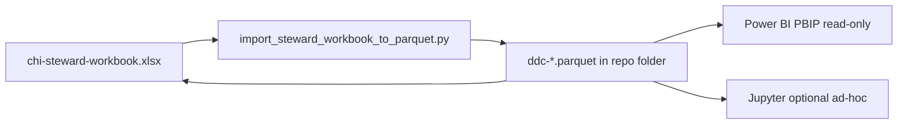

# Excel Workbook Guide (POC)

Local proof-of-concept: **one steward workbook** is the primary surface for a **governed catalog + dictionary** with **ADT/CCDA/FHIR** context. Parquet is the portable machine copy. Vision: `docs/product-vision.md`.

**Maintainers:** before changing workbook generators, read **`docs/excel-workbook-generation-rules.md`** (openpyxl pitfalls, Table naming, AutoFilter rules).

---

## POC scope (what matters now)

| Authoring (in scope) | Optional read | Deferred |
|----------------------|---------------|----------|
| `chi-steward-workbook.xlsx` - edit Catalog + Dictionary + Source_Availability | Power BI PBIP (`workbooks/pbip/chiddc.pbip`) | SharePoint / team portals |
| 5 demographics pilot (`Patient.race`, `.ethnicity`, `.language`, `.gender_id`, `.birth_sex`) | See `docs/power-bi-concept-profile-setup.md` | All 28 data sources |
| `semantic_id` as join key | Jupyter notebook - ad-hoc DuckDB queries only | Partner intake (until onboarding a source) |
| Round-trip: Excel → parquet in this folder | | Full FHIR inventory curation |

**POC success** = a steward can open the workbook, review one concept in `Concept_Explorer`, and see catalog + dictionary + source link on one `semantic_id`.

**What to curate and in what order:** `docs/demographics-pilot-plan.md`

---

## Operating model

### What you have today

```text
Excel (author)  →  import script  →  parquet  →  Power BI Refresh (read)
```

That mirrors a common metadata governance split:

| Layer | Role |
|-------|------|
| **Excel** | Human-friendly authoring |
| **Parquet** | Stable, machine-readable copy (git, scripts, Power BI) |
| **Power BI** | Read-only discovery for reviewers |

For **prove catalog + dictionary before buying a platform**, this is reasonable and maintainable if everyone follows the same **publish ritual** (below).

Excel does **not** update parquet when you save. The import script is the explicit **publish** step so reviewers and Power BI always consume a deliberate snapshot.

For long **Dictionary** fields (`data_quality_notes`, `chi_survivorship_logic`), use line breaks (Alt+Enter in Excel) so Power BI tables wrap cleanly.



### Publish ritual (each curation session)

1. **Edit** `chi-steward-workbook.xlsx` (Catalog, Dictionary, Source_Availability) and **save**.
2. **Publish** to parquet:

   ```powershell
   python scripts/import_steward_workbook_to_parquet.py
   ```

3. **Review** - open `workbooks/pbip/chiddc.pbip` and **Refresh** (see `docs/power-bi-concept-profile-setup.md`).

**Reverse direction** (only when scripts rebuild parquet, not daily use):

```powershell
python scripts/generate_steward_workbook.py
```

`semantic_id` is the stable join key across all layers.

---

## Primary workbook: CHI steward

**Path:** `workbooks/chi-steward-workbook.xlsx`

```powershell
python scripts/generate_steward_workbook.py
python scripts/import_steward_workbook_to_parquet.py
```

### Sheets to use in the POC

### Excel Table names (chi_*)

Each data sheet is a **named Excel Table** (Table Design tab in Excel):

| Excel Table | Sheet tab | Parquet |
|-------------|-----------|---------|
| `chi_catalog` | Catalog | `ddc-master_patient_catalog.parquet` |
| `chi_dictionary` | Dictionary | `ddc-master_patient_dictionary.parquet` |
| `chi_source_availability` | Source_Availability | `ddc-data_source_availability.parquet` |
| `chi_adt_mappings` | ADT_Mappings | `ddc-hl7_adt_catalog.parquet` |
| `chi_ccda_mappings` | CCDA_Mappings | `ddc-ccda_catalog.parquet` |
| `chi_fhir_inventory` | FHIR_Inventory | `ddc-fhir_inventory.parquet` |
| `chi_business_rules` | Business_Rules | `ddc-business_rules.parquet` |
| `chi_source_registry` | Source_Registry | steward metadata |
| `chi_steward_queue` | Steward_Queue | workflow overlay |
| `chi_lookup_lists` | Lookup_Lists | reference lists |

See **Table_Index** sheet for the full map. Naming pattern: `chi_{artifact}` in snake_case.

| Sheet | Use in POC? | Purpose |
|-------|-------------|---------|
| `Concept_Explorer` | **Yes** | Pick `semantic_id` in B3; preview linked fields |
| `Catalog` (`chi_catalog`) | **Yes** | Business context, steward, approval |
| `Dictionary` | **Yes** | FHIR, survivorship, implementation |
| `Source_Availability` | **Yes** | Link concepts to `source_id` |
| `Steward_Queue` | Optional | Workflow notes |
| `ADT_Mappings` | Optional | HL7 demo / CMT work |
| `CCDA_Mappings` | Optional | CCD demo |
| `FHIR_Inventory` | Defer | Reference scaffold from FHIR R5 bundles (`fhir_release_5/`) - not the governed R4 dictionary |
| `Business_Rules` | Defer | Until rule authoring needed |
| `_Model`, `Lookup_Lists` | Auto | Hidden support sheets |

### Data source linking

`Source_Availability` columns:

- `semantic_id` - governed concept
- `source_id` - data source (e.g. `cmt`)
- `availability` - `full`, `partial`, `none`, `unknown`

---

## Secondary workbook: partner intake (defer until needed)

**Path:** `workbooks/chi-partner-intake-workbook.xlsx`

Use when onboarding an external source (jail, HMIS, etc.). Not required for the demographics POC.

**Crosswalk_Template** - partner documents local code → CHI standard mappings (same columns as steward **Source_Value_Crosswalk**). See **`docs/partner-crosswalk-template.md`**.

Each data sheet is a named Excel Table (`chi_intake_*`). Allowed values are in **Lookup_Lists** (no dropdown validations).

| Excel Table | Sheet tab |
|-------------|-----------|
| `chi_intake_source_summary` | Source_Summary |
| `chi_intake_field_inventory` | Field_Inventory |
| `chi_intake_code_values` | Code_Values |
| `chi_intake_crosswalk_template` | Crosswalk_Template |
| `chi_intake_keys_relationships` | Keys_and_Relationships |
| `chi_intake_open_questions` | Open_Questions |
| `chi_intake_curation_bridge` | CHI_Curation_Bridge |
| `chi_intake_governance_load_plan` | Governance_Load_Plan |

```powershell
python scripts/generate_intake_workbook.py
```

---

## POC commands (minimal)

```powershell
.venv\Scripts\activate

# Refresh workbook from parquet
python scripts/generate_steward_workbook.py

# Save Excel edits back to parquet
python scripts/import_steward_workbook_to_parquet.py
```

### Optional (interoperability demos only)

```powershell
python scripts/build_adt_catalog_from_mapping.py
python scripts/build_ccda_catalog_from_mapping.py
python scripts/build_data_source_availability.py
python scripts/build_standards_inventories.py -d .
python scripts/split_to_catalog_and_dictionary.py path\to\combined_export.csv
```

---

## Related documents

- `README.md` - quick start
- `docs/demographics-pilot-plan.md` - pilot status and checklist
- `docs/power-bi-concept-profile-setup.md` - Power BI viewer (refresh after import)
- `TECH-SPEC.md` - full column schemas (reference, not required for daily POC use)
- `docs/cmt-adt-feed-and-master-patient.md` - ADT mapping context
