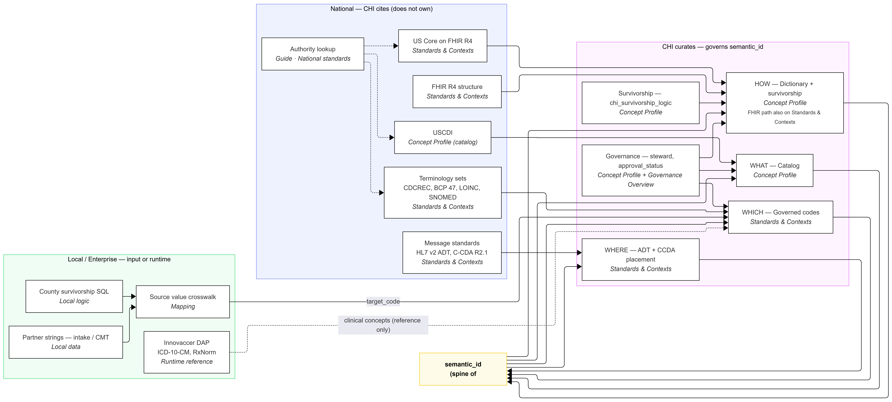

# Sources of truth

How CHI's data dictionary catalog relates to **US interoperability standards**, **enterprise terminology (DAP)**, and **local operational data** - without collapsing them into one bucket.

**Related:** `docs/product-vision.md`, `docs/shie-standards-reference.md`, `TECH-SPEC.md` §1.7, Power BI **Start here** page.

---

## Why this matters for SHIE

SHIE's role is **standards-based interoperability with governed local context**. Partners, stewards, and leadership need to know:

- which layer is **authoritative nationally**
- which layer is **authoritative for CHI**
- which layer is **raw input** that must be mapped

This application documents those layers on a single spine: **`semantic_id`**.

---

## Layered model



*Source: [`docs/assets/chi_ddc_semantic.mmd`](assets/chi_ddc_semantic.mmd) (Mermaid) · SVG: [`chi_ddc_semantic.svg`](assets/chi_ddc_semantic.svg). Same diagram on Power BI **Guide · Start here**.*

```text
USCDI              →  WHAT elements are in scope        (Catalog)
US Core + FHIR R4  →  HOW elements are represented      (Dictionary)
Terminology        →  WHICH coded values are valid      (Value_Set_Bindings / Members)
HL7 v2 / C-CDA     →  WHERE in legacy messages          (ADT / CCDA catalogs)
Crosswalk          →  Local source strings → standards  (Source_Value_Crosswalk)
Survivorship       →  HOW CHI resolves conflicts        (chi_survivorship_logic)
Governance         →  WHO approved metadata             (approval_status, steward)
```

**Master patient truth (L3)** is the canonical demographics layer in operations. ADT, CCDA, and FHIR are **renderings** of governed concepts for exchange - see `TECH-SPEC.md` §1.1.

---

## Who owns what

| Layer | Source of truth | In this repo | This repo does **not** |
|-------|-----------------|--------------|-------------------------|
| Federal data content | [USCDI](https://www.healthit.gov/isa/united-states-core-data-interoperability-uscdi) - **v3** cert baseline (2026); **v3.1+** via SVAP | Catalog: `uscdi_element`, classification | Replace ONC policy |
| US exchange profiles | [US Core](https://hl7.org/fhir/us/core/) on FHIR R4 | Dictionary: `fhir_r4_path`, `fhir_profile` | Act as FHIR server or certifier |
| National terminologies | HL7 THO, LOINC, SNOMED, BCP 47, CDCREC | Bindings → `value_set_url`; members = CHI subset | Host full code systems |
| Enterprise terminology | **Innovaccer DAP** | References in notes; future `dap_value_set_id` | Duplicate ICD/SNOMED catalogs |
| CHI governance | Steward-signed Excel → parquet → git | `approval_status`, survivorship, bindings | Auto-approve without steward |
| County / partner codes | Survivorship SQL, CMT, intake | `Source_Value_Crosswalk` | Treat local strings as national codes |

---

## Three companion terminology tables

See `docs/crosswalk-model.md`:

| Table | Question it answers |
|-------|-------------------|
| `Value_Set_Bindings` | Which standard ValueSet applies? |
| `Value_Set_Members` | Which codes does CHI govern for that concept? |
| `Source_Value_Crosswalk` | What do *our* source codes map to? |

Crosswalk **does not replace** HL7 members. Members = standards; crosswalk = local → standard.

---

## Publish model (CHI metadata truth)

```text
Steward Excel  →  import_steward_workbook_to_parquet.py  →  parquet  →  Power BI Refresh  →  git commit
```

National standards are cited by URL/OID - they do not live in git. **CHI's signed interpretation** does.

Operational ritual: `docs/operational-runbook.md`.

---

## Demographics pilot example

| `semantic_id` | Standards spine | Deliberate distinction |
|---------------|-----------------|------------------------|
| `Patient.race` | USCDI Race → us-core-race → CDCREC / HL7 Race | OMB rollup vs detailed; NullFlavor ≠ race |
| `Patient.ethnicity` | USCDI Ethnicity → us-core-ethnicity → CDCREC | Detail rolls to Hispanic / Not Hispanic |
| `Patient.language` | Preferred language → BCP 47 | ISO 639 crosswalk only |
| `Patient.gender_id` | Gender identity → LOINC 76691-5 → HL7 gender-identity | **Not** CMT SexID / not `birth_sex` |
| `Patient.birth_sex` | Sex → us-core-birthsex | County Table 2 / SexID rollup |

---

## Power BI read surface

| Page | Role |
|------|------|
| **Start here** | Purpose, sources of truth, and layers diagram (static); **default landing** |
| **Standards & Contexts** | Terminology + crosswalk + ADT/CCDA per `semantic_id` |
| **Concept Profile** | Governance + survivorship + sources per `semantic_id` |
| **Governance Overview** | Portfolio status |

---

## PBIP copy sync

Start here page text: `scripts/pbip_start_here_content.py` - update together with this doc when messaging changes.
